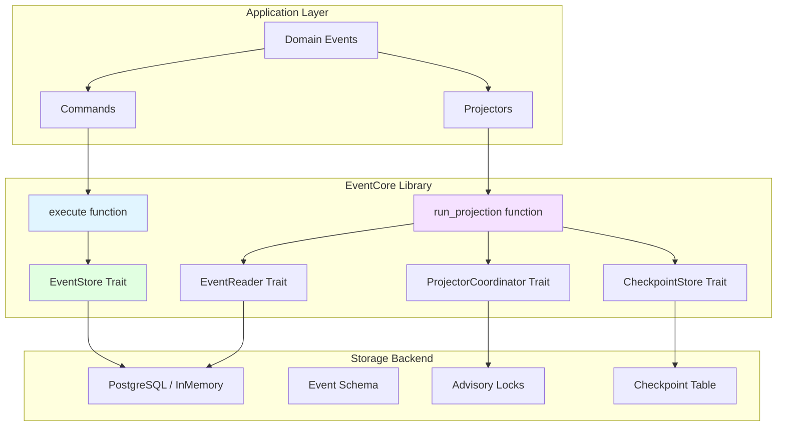
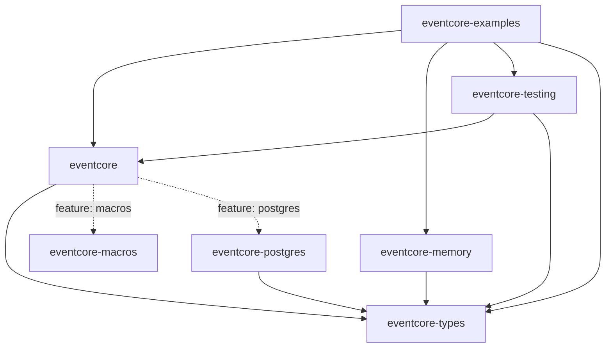
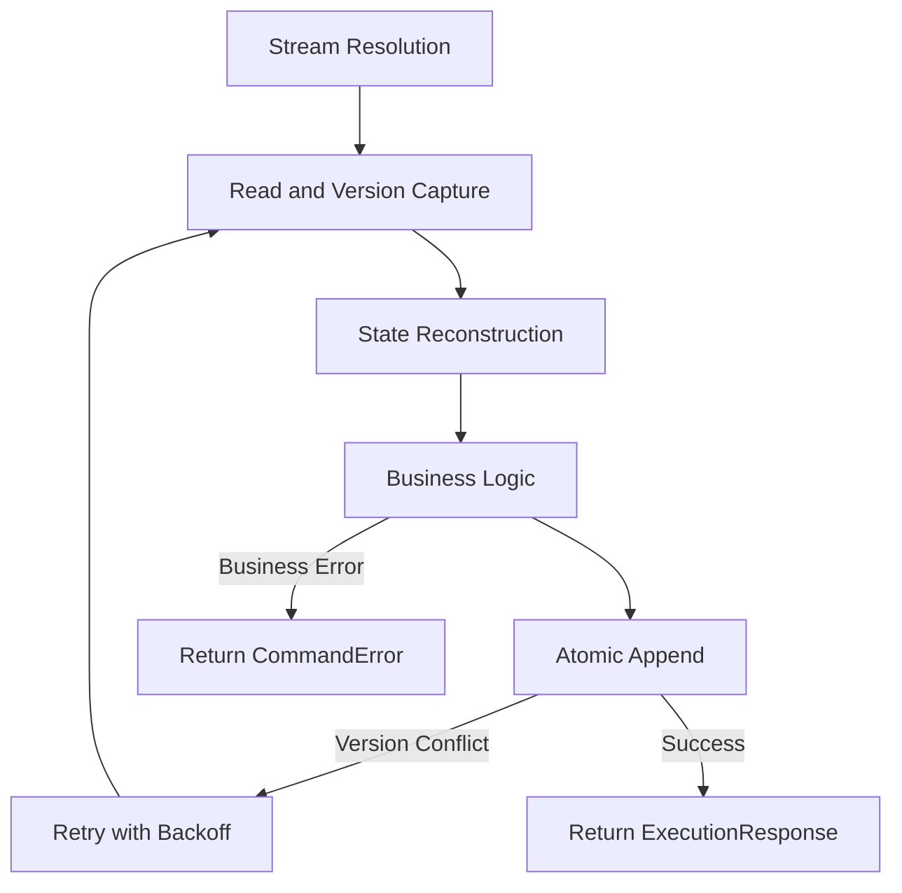
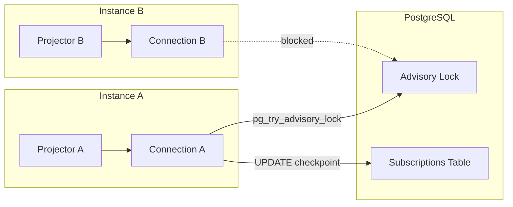

# EventCore Architecture

**Document Version:** 3.0
**Date:** 2026-01-01

## Overview

EventCore is a type-driven event sourcing library for Rust that delivers atomic multi-stream commands, optimistic concurrency, and first-class developer ergonomics. The library enables applications to execute business operations that span multiple event streams within a single atomic transaction, eliminating the need for complex saga patterns when immediate consistency is required.

The architecture follows a clear separation between infrastructure concerns (handled by the library) and domain concerns (implemented by applications). Commands define business operations, events capture state changes as immutable facts, and projections build read models from event streams.



## Design Principles

### Type-Driven Development

All externally visible APIs express domain constraints in their signatures. Domain concepts use validated newtypes (StreamId, EventId, CorrelationId) constructed via smart constructors, ensuring "parse, don't validate" semantics. Types are validated at construction time and guaranteed valid thereafter. Total functions return Result types with descriptive errors rather than panicking.

The library uses the `nutype` crate for domain type validation at boundaries, with types implementing standard traits (Debug, Clone, Serialize, AsRef). Phantom types and typestate patterns make illegal states unrepresentable at compile time.

### Correctness Over Throughput

Multi-stream atomicity, optimistic concurrency detection, and immutability are non-negotiable. Performance optimizations must preserve these guarantees and therefore happen within atomic transaction boundaries provided by the backing store.

### Infrastructure Neutrality

The library owns infrastructure concerns (stream management, retries, metadata, storage abstraction) and never assumes a particular business domain. Applications own their domain events, metadata schemas, and business rules. EventCore does not impose assumptions about "users" or "actors" - applications add business-specific metadata as needed.

### Free-Function APIs

Public entry points are free functions with explicit dependencies (`execute(command, &store)`, `run_projection(projector, &backend)`), keeping the API surface minimal and composable. Structs exist only when grouping configuration or results adds clarity. This design provides:

- Explicit dependencies visible in signatures
- Composable and testable functions
- Alignment with Rust ecosystem patterns (tokio::spawn, serde_json::to_string)
- No unnecessary intermediate structs

### Developer Ergonomics

The `#[derive(Command)]` macro generates all infrastructure boilerplate. Developers write only domain code (state reconstruction and business logic). Automatic retries, contract-test tooling, and in-memory storage support a "working command in 30 minutes" onboarding goal.

## Crate Organization

EventCore uses a multi-crate workspace with a layered public API design that serves two distinct audiences.



### Audience Separation

**Application Developers** (primary audience) use the `eventcore` crate to build event-sourced applications. They need a minimal, focused API: free functions for execution, macros for boilerplate, and just enough types to implement commands and projectors.

**Backend Implementers** (secondary audience) use the `eventcore-types` crate to build storage backends. They need access to all traits and types required to implement `EventStore`, `EventReader`, `CheckpointStore`, and `ProjectorCoordinator`.

### Crate Responsibilities

| Crate | Audience | Purpose |
|-------|----------|---------|
| `eventcore` | Application developers | `execute()`, `run_projection()`, macros, minimal types for commands/projectors |
| `eventcore-types` | Backend implementers | All traits (`EventStore`, `EventReader`, etc.) and types for implementations |
| `eventcore-macros` | Application developers | `#[derive(Command)]`, `require!` |
| `eventcore-postgres` | Both | PostgreSQL backend implementing all storage traits |
| `eventcore-testing` | Backend implementers | Contract tests, chaos harness, test fixtures |
| `eventcore-memory` | Both | In-memory storage for testing and development |
| `eventcore-examples` | Application developers | Integration tests and demo applications |

### Layer 1: Application Developer API (`eventcore`)

The main crate exports only what application developers need:

**Primary Entry Points:**
- `execute()` - Run commands against an event store
- `run_projection()` - Run projectors against a backend

**Command Infrastructure:**
- `RetryPolicy`, `BackoffStrategy` - Configure retry behavior
- `ExecutionResponse` - Command execution result
- `MetricsHook`, `RetryContext` - Metrics integration

**Macros:**
- `Command` derive macro
- `require!` macro for business rule validation

**Minimal Re-exports:**
- `CommandLogic`, `CommandStreams`, `CommandError`, `Event`, `StreamId`
- `StreamDeclarations`, `NewEvents`, `StreamResolver`
- `Projector`, `FailureContext`, `FailureStrategy`, `StreamPosition`

**NOT Exported** (internal implementation details):
- `ProjectionRunner` - Use `run_projection()` instead
- `PollMode`, `PollConfig` - Operational tuning, not application code
- `EventRetryConfig` - Controlled by `Projector::on_error()` return values

### Layer 2: Backend Implementer API (`eventcore-types`)

This crate exports everything needed to implement storage backends:

**Traits for Implementation:**
- `EventStore` - Core event storage abstraction
- `EventReader` - Read events across streams
- `CheckpointStore` - Track projection progress
- `ProjectorCoordinator` - Leader election for projectors

**Types for Trait Implementations:**
- `EventStoreError`, `Operation` - Error handling
- `EventStreamReader`, `EventStreamSlice` - Event reading results
- `StreamWrites`, `StreamWriteEntry`, `StreamVersion` - Event writing
- `EventFilter`, `EventPage` - Event querying
- `StreamPrefix` - Stream pattern matching

### Feature Flag Ergonomics

Users enable storage adapters via feature flags on the main crate:

```toml
[dependencies]
eventcore = { version = "0.5", features = ["postgres"] }
```

This pattern matches Rust ecosystem norms (tokio, sqlx, reqwest) while keeping the API surface minimal.

## Event Store Abstraction

### Core Operations

The `EventStore` trait exposes two fundamental operations:

1. **Read Operations** - `read_stream` / `read_streams` fetch all events for one or more streams, returning both events and current stream versions.

2. **Append Operations** - `append_events` atomically registers new streams (if needed) and appends events to one or more streams while verifying expected versions.

### Multi-Stream Atomicity

Multi-stream atomicity is achieved by delegating to the backend's native transaction mechanism:

- PostgreSQL uses ACID transactions
- In-memory stores use mutex-protected synchronization
- Future backends may use other appropriate mechanisms

Append operations are "all-or-nothing" across every stream referenced in a command. Backend implementations hide their transaction mechanics; the trait merely promises atomic semantics. This design eliminates the need for complex saga patterns when business operations span multiple entities.

### Optimistic Concurrency Control

Version-based conflict detection ensures concurrent commands cannot corrupt state:

- Each stream tracks a monotonically increasing `StreamVersion` starting at 0
- Every appended event increments the version by 1
- During execution, the executor captures versions for each stream it reads
- `append_events` receives the map of expected versions and atomically verifies all of them
- A mismatch on any stream yields `EventStoreError::VersionConflict` (retriable)
- Version verification occurs inside the backend transaction to eliminate time-of-check-to-time-of-use races

### Event Metadata

All persisted events carry immutable metadata:

| Field | Purpose |
|-------|---------|
| `EventId (UUIDv7)` | Globally ordered identity for cross-stream projections and debugging |
| `StreamId` and `StreamVersion` | Aggregate identity and per-stream ordering |
| `Timestamp` | Commit time (not command start time) |
| `CorrelationId` | Logical operation identifier (stable across retries) |
| `CausationId` | Immediate trigger of the event (usually the command) |
| `CustomMetadata<M>` | Application-defined, strongly typed metadata payload |

UUIDv7 provides time-based ordering while maintaining uniqueness guarantees without coordination. Metadata is validated at construction time, persisted verbatim by every backend, and never mutated after commit.

### Storage Implementations

- **InMemoryEventStore** ships inside the main crate with zero third-party dependencies. It is the default for tests, tutorials, and quickstarts.
- **Production backends** (e.g., PostgreSQL via `eventcore-postgres`) live in separate crates to avoid imposing heavy dependencies. They implement `EventStore` and, when applicable, `EventReader`.
- All implementations must support contract testing and optional instrumentation for observability.

### Contract Testing

A reusable contract test suite (`eventcore_testing::contract`) verifies that implementations:

- Detect version conflicts under concurrent writes (single and multi-stream scenarios)
- Enforce atomicity - either all streams are updated or none are
- Preserve metadata and ordering guarantees
- Classify errors correctly (retriable vs permanent)

Every backend (first-party or third-party) integrates these tests into its CI pipeline to guarantee semantic compliance. The contract test suite is provided by the `eventcore-testing` crate, which should be added as a dev-dependency to keep production builds lean.

## Event System

### Domain-First Event Trait

Domain events implement the simple `Event` trait:

```rust
pub trait Event: Clone + Send + Serialize + DeserializeOwned + 'static {
    fn stream_id(&self) -> &StreamId;
}
```

Key characteristics:

- Developers model events as plain structs with owned data
- `Serialize + DeserializeOwned` bounds enable JSON/binary storage without infrastructure wrappers
- The `'static` bound ensures events are self-contained values suitable for storage, async boundaries, and cross-thread movement
- StreamId represents aggregate identity - a domain concept, not purely infrastructure
- No infrastructure wrapper is required; domain types ARE events by implementing the trait

### Event Type Identity

Events carry type identity through the `EventTypeName` mechanism:

- Each event type has a string name (e.g., "MoneyDeposited")
- The `Subscribable` trait provides `subscribable_type_names()` for filtering by type
- Type names enable filtering, routing, and cross-language interoperability

### StreamId Character Restrictions

StreamId values cannot contain glob metacharacters (`*`, `?`, `[`, `]`) to enable unambiguous future pattern matching in subscription queries. Valid identifiers include UUIDs, hierarchical paths (`tenant/account/123`), and composite keys (`order-2024-12-10-001`).

## Command Model

### Macro-Generated Infrastructure

The `#[derive(Command)]` macro transforms annotated struct fields into full command infrastructure:

```rust
#[derive(Command)]
struct TransferMoney {
    #[stream]
    from_account: StreamId,
    #[stream]
    to_account: StreamId,
    amount: Money,
}
```

The macro produces:

- A phantom `StreamSet` type encoding the declared streams
- An implementation of `CommandStreams` that surfaces stream declarations to the executor
- Compile-time enforcement that only declared streams can be targeted via `StreamWrite<StreamSet, Event>` and the `emit!` macro

### CommandLogic Trait

Developers implement `CommandLogic` for domain behavior:

```rust
impl CommandLogic for TransferMoney {
    type State = AccountPairState;
    type Event = AccountEvent;

    fn apply(&self, state: Self::State, event: &Self::Event) -> Self::State {
        // Fold events into state
    }

    fn handle(&self, state: Self::State) -> Result<NewEvents<Self::Event>, CommandError> {
        require!(state.can_transfer(self.amount), "Insufficient funds");
        emit!(state.ctx, AccountDebited { /* ... */ });
        emit!(state.ctx, AccountCredited { /* ... */ });
        Ok(state.ctx.into())
    }

    fn stream_resolver(&self) -> Option<&dyn StreamResolver<Self::State>> {
        None
    }
}
```

- `apply` reconstructs state by folding historical events
- `handle` validates business rules and produces new domain events using the type-safe `emit!` helper
- `stream_resolver` is optional; commands needing runtime discovery return `Some(self)` (or another resolver)

### Trait Separation

The command system uses two separate traits:

**CommandStreams** (generated by macro):
- Extracts stream IDs from command fields
- Manages phantom type for compile-time tracking
- Handles interaction with EventStore trait
- Pure boilerplate - no business logic

**CommandLogic** (implemented by developers):
- `apply(state, event)` - reconstructs state from events
- `handle(state)` - validates business rules and produces events
- Contains only domain-specific logic
- No infrastructure concerns

### Dynamic Stream Discovery

When commands implement `StreamResolver<State>`, the executor uses a queue-based algorithm:

1. Seeds a `VecDeque<StreamId>` with statically declared streams
2. Maintains `scheduled` and `visited` hash sets to deduplicate work
3. Pops a stream ID, reads it exactly once, folds events, and records the stream's version
4. Invokes `discover_related_streams(&state)` to enqueue additional stream IDs discovered from reconstructed state
5. Continues until the queue is empty

This approach:
- Eliminates multi-pass re-read loops
- Ensures both static and discovered streams participate in optimistic concurrency
- Uses incremental reading (only new events from already-read streams)
- Provides deterministic FIFO ordering for diagnostics and testing

Discovery errors are permanent (no retry) since they indicate programming errors, not transient conditions.

## Command Execution Pipeline

The primary API is the async free function `execute(command, store)`. Each attempt runs five deterministic phases:



### Execution Phases

1. **Stream Resolution** - Ask the command for its static stream declarations and seed the dynamic discovery queue.

2. **Read and Version Capture** - Drain the queue, reading each stream exactly once, folding events into state, and building the expected-version map.

3. **State Reconstruction** - After all required streams have been read, the accumulated state represents a consistent snapshot for the command.

4. **Business Logic** - Invoke `CommandLogic::handle`, producing `NewEvents` (potentially empty) or returning `CommandError` for validation/business rule failures.

5. **Atomic Append** - Write all emitted events using the captured expected versions. Any mismatch triggers `EventStoreError::VersionConflict`.

### Automatic Retry with Backoff

If Phase 5 returns a concurrency error:

- The executor consults the configurable `RetryPolicy` (max attempts, base delay, multiplier, optional jitter)
- After waiting for the computed backoff, execution restarts from Phase 2 with a fresh queue and state
- Correlation and causation IDs remain unchanged so tracing reflects a single logical operation
- Permanent errors (validation failures, business rule violations, non-retriable storage errors) short-circuit and return immediately with enriched context

Exponential backoff reduces lock contention by spacing retry attempts progressively. Optional jitter further randomizes timing to prevent synchronized retries (thundering herd).

### Metadata Continuity

- Correlation IDs are generated once per `execute` call and preserved across retries
- Causation IDs typically use the command identifier and never change
- Commit timestamps reflect when events are successfully persisted, not when execution began

## Poll-Based Projections

### Design Philosophy

Projections use poll-based event retrieval rather than push-based streaming. This design aligns control flow with transactional requirements - the projector controls when to fetch events, applies them transactionally, and checkpoints atomically.

| Concern | Poll-Based Approach |
|---------|---------------------|
| Transaction boundaries | Projector fetches within transaction |
| Checkpoint atomicity | Same transaction as projection |
| Error recovery | Simple - restart from checkpoint |
| Backpressure | Just don't poll |
| Testing | Deterministic |
| Implementation | Simple database query |

### EventReader Trait

```rust
pub trait EventReader {
    async fn read_events_after<E: Subscribable>(
        &self,
        query: SubscriptionQuery,
        after: Option<StreamPosition>,
        limit: usize,
    ) -> Result<Vec<(E, StreamPosition)>, EventStoreError>;
}
```

**StreamPosition** wraps the event's UUID7 identifier, providing a monotonically increasing, globally sortable position for tracking projection progress.

### Subscribable Trait

The `Subscribable` trait enables type filtering for subscriptions:

```rust
pub trait Subscribable: Clone + Send + 'static {
    fn subscribable_type_names() -> Vec<EventTypeName>;
    fn try_from_stored(type_name: &EventTypeName, data: &[u8]) -> Result<Self, SubscriptionError>;
}
```

Key features:

- Blanket implementation for all Event types provides zero-cost adoption
- View enums can implement Subscribable directly without implementing Event
- Type name-based filtering distinguishes enum variants at the storage level
- `try_from_stored` returns Result for graceful schema evolution handling

### Projector Trait

```rust
pub trait Projector: Send + 'static {
    type Event: Subscribable;
    type Error: std::error::Error + Send;
    type Context;

    fn apply(
        &mut self,
        event: Self::Event,
        position: StreamPosition,
        ctx: &mut Self::Context
    ) -> Result<(), Self::Error>;

    fn on_error(&mut self, failure: FailureContext<Self::Event, Self::Error>) -> FailureStrategy {
        FailureStrategy::Fatal
    }

    fn after_apply(&mut self, event: &Self::Event, ctx: &Self::Context) -> Result<(), Self::Error> {
        Ok(())
    }

    fn name(&self) -> &str;
}
```

The trait provides:

- **apply()** - Updates the read model for a single event within the provided context
- **on_error()** - Returns failure strategy (Fatal, Skip, or Retry) when projection fails
- **after_apply()** - Lifecycle hook for side effects like notifications and metrics

### Projection Runner API

```rust
pub async fn run_projection<P, B>(
    projector: P,
    backend: &B,
) -> Result<(), ProjectionError>
where
    P: Projector,
    B: EventReader + CheckpointStore + ProjectorCoordinator,
```

This design optimizes for the common case where a single backend provides all three capabilities:

```rust
// Simple case (99.9% of deployments)
run_projection(my_projector, &postgres_store).await?;
```

For mixed-backend deployments, users create a wrapper struct implementing all three traits.

### Projection Execution Loop

```rust
// Acquire leadership - returns error if lock already held
guard = coordinator.try_acquire(projector.name())?;

loop {
    events = poll_events_after(checkpoint)
    for event in events {
        apply_event_in_transaction(event)
        update_checkpoint_atomically(event.position)
    }
    sleep_if_no_events()
}
// guard dropped - leadership released automatically
```

### Error Handling Strategies

Three strategies are available for projection failures:

- **Fatal (Default)** - Stop immediately, prevent silent projection drift
- **Skip** - Log the error and continue to next event (use for non-critical projections)
- **Retry** - Retry with configurable backoff for transient failures

All strategies preserve temporal ordering - events are never processed out of order.

### Projector Configuration

Per-projector configuration covers two distinct concerns:

**Poll Configuration (Infrastructure Level):**
- `poll_interval` - Duration between successful polls (default: 100ms)
- `empty_poll_backoff` - Wait when poll returns no events (default: 1 second)
- `poll_failure_backoff` - Backoff when infrastructure fails (default: exponential)
- `max_consecutive_poll_failures` - Exit threshold (default: 10)

**Event Retry Configuration (Application Level):**
- `max_retry_attempts` - Maximum retries before Fatal (default: 3)
- `retry_delay` - Initial delay between retries (default: 100ms)
- `retry_backoff_multiplier` - Multiplier for delays (default: 2.0)
- `max_retry_delay` - Cap on retry delay (default: 5 seconds)

## Projector Coordination

### The Distributed Coordination Challenge

Production systems typically run multiple application instances. Without coordination, multiple instances would process the same events concurrently, causing:

- Checkpoint races (race conditions between instances updating the same checkpoint)
- Read model corruption (concurrent projection writes interleaving)
- Ordering violations (parallel processing undermines sequential guarantees)

### Subscription Table and Advisory Locks

The coordination mechanism separates two concerns:

**Subscriptions Table** - Tracks checkpoint state:
- Schema: `(subscription_name TEXT PRIMARY KEY, last_position BIGINT, updated_at TIMESTAMPTZ)`
- Purpose: WHERE did we process up to?
- Updated transactionally with projection writes

**Advisory Locks** - Coordinates WHO is processing:
- Acquired via `pg_try_advisory_lock(hash(subscription_name))` (non-blocking)
- Returns immediately with success/failure
- Held for session duration (connection open)
- Released automatically when connection closes



### Dedicated Connections

Each projector owns a dedicated database connection for its entire lifetime, not a connection from a pool. This is essential because:

- Advisory locks are session-scoped - tied to a specific database connection
- Connection lifetime = projector lifetime = lock lifetime
- When the process crashes or exits, the connection closes and the lock releases automatically
- No separate heartbeat table or validity checking needed

### Non-Blocking Lock Acquisition

Leadership acquisition uses `pg_try_advisory_lock()` which returns immediately. If another instance already holds the lock:

- Returns `LockNotAcquired` error immediately (does not block)
- Callers decide how to handle: exit process, sleep and retry, or continue without projection
- Recommended: exit and let orchestrators (Kubernetes, systemd) handle restart with backoff

### Crash Safety

The key insight is aligning three lifecycles: projector process, database connection, and advisory lock. When any terminates, the others follow:

- **Process crashes**: Connection closes, lock released automatically
- **Network partition**: Connection times out, lock released automatically
- **Graceful shutdown**: Guard dropped, connection closed, lock released

No separate heartbeat mechanism is needed because the database session itself provides the liveness signal.

### Stuck Projector Detection

Hung projectors (infinite loops, deadlocks with connection alive) are detected via application monitoring rather than infrastructure coordination:

- Monitor time since last checkpoint update (`updated_at` in subscriptions table)
- Alert if a projector hasn't made progress in N minutes
- Coordinate restart via orchestration layer

## Error Handling

### Error Categories

- **CommandError** - Domain failures (validation, business rule violations, infrastructure issues)
- **EventStoreError** - Storage-layer failures (version conflicts, connectivity, serialization)
- **ValidationError** - Raised by newtype constructors
- **SubscriptionError** - Projection failures (deserialization, unknown event types)

### Retry Classification

Errors implement marker traits indicating retriability:

- **Retriable**: ConcurrencyError, network timeouts
- **Permanent**: Validation errors, business rule violations, schema errors

The executor and projector consult this classification before attempting retries.

### Context Enrichment

Errors carry diagnostic information:

- Correlation ID and Causation ID for distributed tracing
- Stream identifiers and operation context
- Detailed messages without sensitive data exposure

## Testing Architecture

### Contract Testing

The `eventcore-testing` crate provides contract test suites for:

- EventStore implementations (version conflicts, atomicity, metadata preservation)
- EventReader implementations (ordering, filtering, position tracking)
- ProjectorCoordinator implementations (mutual exclusion, crash-safe release)

All backends integrate these tests into their CI pipeline to guarantee semantic compliance.

### Black-Box Integration Testing

Integration tests verify command execution via projections, not direct event store access. This approach:

- Uses the same APIs as real applications (dogfooding)
- Demonstrates intended usage patterns
- Keeps `EventStore` trait exclusively in `eventcore-types`

The `EventCollector` projector in `eventcore-testing` collects events for assertion:

```rust
execute(&mut store, &command).await?;
let collector = EventCollector::<MyEvent>::new();
run_projection(collector, &backend).await?;
assert_eq!(collector.events(), vec![expected_event]);
```

### Test Crate Organization

Integration tests live in the `eventcore-examples` crate, which sits at the top of the dependency graph and can depend on all other crates without creating circular dependencies.

## Deployment Patterns

### Single-Process Deployment

For simpler deployments:

- InMemoryEventStore for development and testing
- Single projector instance per projection type
- No coordination overhead needed

### Production Deployment

For production systems:

- PostgreSQL backend with ACID guarantees
- PostgreSQL advisory locks for projector coordination (dedicated connections)
- Multiple application instances for availability - projectors automatically elect leaders
- Contract tests verify backend compliance
- Observability via structured logging and metrics

### Configuration

```toml
# Development/testing (default)
[dependencies]
eventcore = "0.5"

# Production with PostgreSQL
[dependencies]
eventcore = { version = "0.5", features = ["postgres"] }
```

## Versioning Policy

EventCore follows a lockstep versioning strategy across all workspace crates using Cargo workspace version inheritance:

- All crates maintain identical major, minor, AND patch version numbers
- Single source of truth in workspace `Cargo.toml`
- Clear compatibility guarantee: matching versions are compatible

### Release Automation

Releases are managed through a two-phase workflow:

1. **Release PR Preview** - Automated PR with version bumps and changelog, requiring all CI quality gates to pass
2. **Publication to crates.io** - Triggered by PR merge, publishing crates in dependency order

## Quality Attributes

### Correctness

- Multi-stream atomicity via storage-native transactions
- Optimistic concurrency with version checking
- Contract tests verify semantic compliance
- Type system prevents invalid states

### Performance

- Read-heavy workloads scale via event store read replicas
- Write operations bounded by backend transaction capacity
- Poll-based projections control their own processing cadence
- Exponential backoff reduces contention under concurrent load

### Maintainability

- Clear separation between infrastructure and domain code
- Macro-generated boilerplate keeps domain code clean
- Contract tests enable confident backend evolution
- Comprehensive error context aids debugging

### Extensibility

- Pluggable storage backends via EventStore trait
- Custom projections via Projector trait
- Application-defined event metadata
- Optional StreamResolver for dynamic discovery
- Adapter crates depend only on `eventcore-types`, enabling independent development

## Summary

EventCore provides a cohesive architecture for event-sourced applications:

1. **Type-safe domain modeling** with zero boilerplate for infrastructure
2. **Deterministic, atomic execution** of complex multi-stream business operations
3. **Automatic concurrency management** and retry behavior that keeps business code simple
4. **Poll-based projections** with integrated checkpoint management for correct read models
5. **Unified backend traits** for simplified backend implementations
6. **Advisory lock coordination** for distributed deployments using session-scoped locks
7. **Per-projector configuration** with orthogonal concerns (poll, retry, monitoring)
8. **Rich metadata and observability** hooks for auditing, compliance, and debugging
9. **Pluggable storage backends** validated by a shared contract suite
10. **Feature flag ergonomics** matching Rust ecosystem patterns
11. **Lockstep versioning** with automated release management
