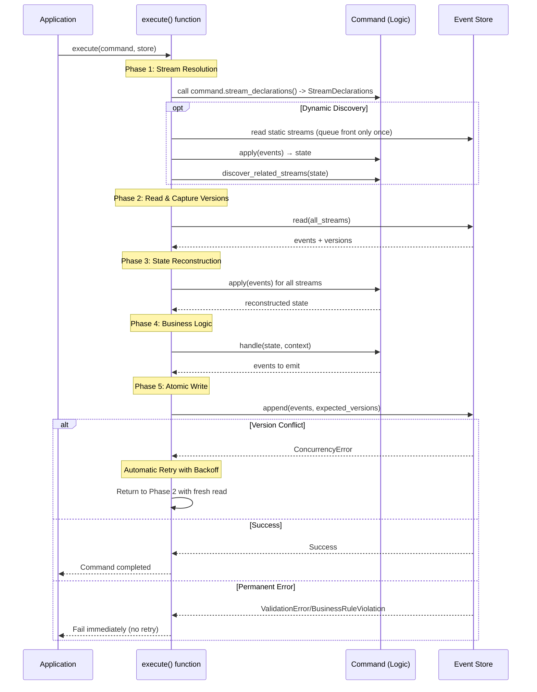

# EventCore Architecture

**Document Version:** 1.3
**Date:** 2025-10-29
**Phase:** 4 - Architecture Synthesis (Updated for ADR-013)

## Overview

EventCore is a type-safe event sourcing library for Rust that implements **multi-stream event sourcing with dynamic consistency boundaries**. Unlike traditional event sourcing frameworks that enforce rigid aggregate boundaries, EventCore enables commands to atomically read from and write to multiple event streams, allowing developers to define consistency boundaries that match their business requirements rather than technical constraints.

**Target Audience:** Rust developers building event-sourced systems who need strong consistency guarantees across related business entities without the complexity of sagas or process managers.

**Core Value Proposition:** EventCore eliminates the artificial constraints of traditional event sourcing by enabling atomic multi-stream operations while maintaining type safety, strong consistency guarantees, and developer ergonomics through code generation.

## Architectural Principles

EventCore's architecture is guided by five foundational principles that inform all design decisions:

### 1. Type-Driven Development

The type system enforces domain constraints and prevents illegal states at compile time (ADR-003):

- **Parse, Don't Validate**: Domain types validate at construction time using `nutype`, guaranteeing validity thereafter
- **No Primitive Obsession**: All domain concepts use validated newtypes (StreamId, EventId, etc.)
- **Total Functions**: All public APIs use Result types; no unwrap/expect in library code
- **Making Illegal States Unrepresentable**: Phantom types and typestate patterns prevent invalid operations at compile time

### 2. Correctness Over Performance

Multi-stream atomicity and consistency are non-negotiable (ADR-001):

- Atomic operations across multiple streams using storage-native transactions
- Optimistic concurrency control ensures no lost updates
- All events written or none - no partial state updates
- Version conflicts detected 100% of the time
- Performance optimizations must work within correctness constraints

### 3. Infrastructure Neutrality

EventCore is library infrastructure, not business framework:

- No assumptions about business domains (no "users", "actors", etc.)
- Applications define domain-specific metadata structures
- Pluggable storage backends via trait abstraction
- Async runtime agnostic (Tokio, async-std)
- Minimal opinionated dependencies

### 4. Free Function API Design

Public API consists primarily of free functions, not methods on structs (ADR-010):

- **Minimal API Surface**: Types remain private until compiler requires public exposure
- **Composability**: Free functions enable function composition, partial application, easier testing
- **Explicit Dependencies**: All inputs visible in signatures - no hidden state
- **Compiler-Driven Evolution**: Types made public only when compiler or tests force it
- **Clear Data Flow**: Parameter passing makes ownership and data dependencies explicit

### 5. Developer Ergonomics

Minimize boilerplate while maximizing type safety (ADR-006):

- `#[derive(Command)]` macro eliminates infrastructure code
- Automatic retry on version conflicts - zero manual retry logic
- Compile-time safety prevents runtime errors
- Clear separation between infrastructure and business logic
- Developers write only domain-specific code

## Core Architecture

EventCore's architecture comprises six major components that work together to provide multi-stream event sourcing with type safety and automatic concurrency control.

### Component Overview

```mermaid
graph TB
    App[Application Code]
    ExecFn[execute() function]
    Cmd[Command System]
    Events[Event System]
    Store[Event Store Abstraction]
    Backend[Storage Backend]

    App -->|"execute(command, store)"| ExecFn
    ExecFn -->|"extract streams"| Cmd
    ExecFn -->|"read/append domain events"| Events
    Events -->|"via trait bounds"| Store
    Store -->|"ACID transactions"| Backend
    Cmd -->|"apply/handle domain events"| App

    subgraph "Type System"
        Types[Validated Domain Types]
        Errors[Error Hierarchy]
        Meta[Event Metadata]
    end

    ExecFn -.->|"uses"| Types
    ExecFn -.->|"produces"| Errors
    Store -.->|"preserves"| Meta
    Events -.->|"domain types implement"| Types

    style ExecFn fill:#e1f5ff
    style Store fill:#e1ffe1
    style Cmd fill:#ffe1e1
    style Events fill:#fff3cd
```

### 1. Event Store Abstraction (ADR-002, ADR-013)

**Purpose:** Pluggable storage abstraction supporting atomic multi-stream operations.

**Core Operations:**

- **Read**: Query events from one or more streams
- **Atomic Append**: Write events to multiple streams atomically with version checking

**Key Characteristics:**

- Atomicity mechanisms internal to backend implementations (PostgreSQL ACID, in-memory locks)
- Version-based optimistic concurrency control (ADR-007)
- Metadata preservation for audit and tracing (ADR-005)
- Separate EventSubscription trait for projection building
- Contract test suite verifies semantic behavior (ADR-013)

**Storage Backend Examples:**

- `eventcore-postgres`: Production backend using PostgreSQL ACID transactions (separate crate)
- `InMemoryEventStore`: In-memory backend for testing with optional chaos injection (included in main `eventcore` crate)

**Contract Testing (ADR-013):**

EventCore provides a reusable contract test suite (`eventcore::testing::event_store_contract_tests`) that verifies EventStore implementations handle critical semantic behaviors correctly:

- Version conflict detection under concurrent writes
- Multi-stream atomic semantics
- Correct error variant classification
- Metadata preservation

All EventStore implementations (in-tree and external) MUST run and pass the contract test suite. This approach follows Rust ecosystem patterns (similar to Iterator, Clone traits) where semantic contracts are documented and verified through integration tests rather than type-system enforcement.

**Why Contract Tests Over Type Enforcement:** Version checking is runtime behavior (semantic contract), not structural constraint. Type-state patterns cannot eliminate trust boundaries for runtime behavior. Integration tests verify actual behavior under realistic concurrent scenarios, providing stronger guarantees than compile-time structural checks. This maintains API simplicity while ensuring correctness.

**Why This Design:** Pushes atomicity complexity into battle-tested storage layers where it belongs, keeping library code simple while enabling backend flexibility. Contract tests provide verification mechanism with zero API complexity cost.

### 2. Event System (ADR-012)

**Purpose:** Domain-first event representation where domain types ARE events, not wrapped in infrastructure.

**Event Trait Design:**

EventCore uses a trait-based approach where domain types implement the Event trait directly:

```rust
trait Event: Clone + Send + 'static {
    fn stream_id(&self) -> &StreamId;
}
```

**Domain Types as Events:**

Instead of wrapping domain types in infrastructure containers, domain types ARE events:

```rust
// Domain event type
struct MoneyDeposited {
    account_id: StreamId,  // Aggregate identity (domain concept)
    amount: u64,
}

// Implement Event trait
impl Event for MoneyDeposited {
    fn stream_id(&self) -> &StreamId {
        &self.account_id
    }
}
```

**Why Domain-First Design:**

- **Domain in Foreground:** Developers work directly with domain types (MoneyDeposited, AccountCredited), not infrastructure wrappers (Event<T>)
- **StreamId as Domain Identity:** Aggregate identity (StreamId) lives naturally in domain type where it belongs per DDD principles
- **Clearer Ubiquitous Language:** Code reads as business language without infrastructure noise
- **Better API Ergonomics:** `append(money_deposited)` instead of `append(Event { payload: money_deposited })`

**Trait Bounds Rationale:**

- **Clone:** Required for state reconstruction - events consumed multiple times during `apply()`
- **Send:** Required for async storage backends and cross-thread event handling
- **'static:** Required for type erasure in storage and async trait boundaries - events must own their data

**Trade-off Accepted:** Events cannot contain borrowed references, must own all data. This aligns with event sourcing best practice: events are immutable permanent records and should be self-contained.

**Integration with Command System:**

Commands work directly with domain event types through generic trait bounds:

```rust
impl CommandLogic for TransferMoney {
    type Event = AccountEvent;  // Domain event type

    fn apply(&self, state: Self::State, event: &Self::Event) -> Self::State {
        // Apply domain event directly
    }

    fn handle(&self, state: Self::State, ctx: Context) -> Result<()> {
        emit!(ctx, MoneyDeposited {
            account_id: self.from_account,
            amount: self.amount
        });
        Ok(())
    }
}
```

**Storage Integration:**

Event stores work with trait bounds, not concrete types:

```rust
// Generic method accepting any type implementing Event
fn append<E: Event>(&self, event: E) -> Result<()> {
    let stream_id = event.stream_id();  // Extract via trait method
    // Store using type erasure...
}
```

**Metadata Handling:**

Event metadata (timestamps, correlation IDs, etc.) remains an infrastructure concern handled separately from domain types. See ADR-005 for metadata structure. The Event trait provides domain identity (stream_id); infrastructure manages audit trail, causation, and temporal ordering.

**Why This Design:** Aligns with Domain-Driven Design by making domain types first-class citizens. Infrastructure (Event trait) provides capabilities without obscuring the domain model. Maintains type safety through generic trait bounds while eliminating wrapper ceremony.

### 3. Command System (ADR-006)

**Purpose:** Declarative command definition with compile-time stream access control.

**Components:**

**Command Macro (`#[derive(Command)]`):**

- Generates infrastructure boilerplate from `#[stream]` field attributes
- Creates phantom types for compile-time stream tracking
- Implements CommandStreams trait (infrastructure)
- Enables `emit!` macro for type-safe event emission

**CommandStreams Trait (Macro-Generated):**

- Extracts stream IDs from command fields
- Manages phantom types for compile-time access control
- Provides fn stream_declarations(&self) -> StreamDeclarations which the executor uses to resolve streams
- Pure infrastructure - no business logic

**CommandLogic Trait (Developer-Implemented):**

- `type Event`: Associated type specifying domain event type (must implement Event trait)
- `apply(state, &event)`: Reconstruct state from domain event history
- `handle(state, context)`: Validate business rules and emit domain events
- Domain-specific logic only - works directly with domain event types

**StreamResolver Trait (Optional, ADR-009):**

- `discover_related_streams(state)`: Discover streams at runtime based on reconstructed state
- Executor queues newly discovered streams, deduplicates IDs, and reads each stream exactly once per execution attempt
- Integrates with static declarations for hybrid static/dynamic stream sets so all participating streams share the same optimistic concurrency guarantees

**Why This Design:** Clear separation between infrastructure (generated) and business logic (hand-written) minimizes boilerplate while maintaining compile-time safety. Optional dynamic discovery provides flexibility without compromising common-case simplicity.

### 3. Command Execution (ADR-008, ADR-010)

**Purpose:** Orchestrate command execution with automatic retry on version conflicts via free function API.

**API Design (ADR-010):**

EventCore provides command execution through a free function, not a struct method:

```rust
// Public API: free function with explicit dependencies
pub async fn execute<C, S>(
    command: C,
    store: &S,
) -> Result<ExecutionResponse, CommandError>
where
    C: CommandLogic, // CommandLogic now implies CommandStreams
    S: EventStore,
```

**Why Free Functions:**

- **Explicit Dependencies**: Store passed as parameter, making data flow clear
- **Composability**: Function can be wrapped, partially applied, composed with combinators
- **Minimal API Surface**: No CommandExecutor struct to learn or manage
- **Testability**: Mock dependencies passed explicitly, no struct lifecycle concerns
- **Compiler-Driven Types**: Supporting types made public only when compiler requires it

**Execution Flow:**



**Dynamic Discovery Workflow:** The executor maintains a FIFO queue of stream IDs. Static declarations seed the queue and every stream is read exactly once per attempt. After each read the executor folds events into the command state and, if `stream_resolver()` returns `Some(_)`, invokes `discover_related_streams(state)` to enqueue additional streams. A `HashSet` prevents duplicates so redundant IDs from the resolver are ignored. Every visited stream contributes an expected version entry, meaning both static and resolver-discovered streams participate in a single optimistic-concurrency check at write time.

**Retry Logic:**

- Automatic retry on ConcurrencyError (version conflicts)
- Exponential backoff reduces contention (10ms, 20ms, 40ms, ...)
- Configurable max attempts and backoff strategy
- Re-reads streams on every retry for fresh state
- Metadata (correlation/causation) preserved across retries
- Permanent errors fail immediately without retry

**Why This Design:** Centralizes infrastructure concerns (retry, orchestration) in the execute function, keeping command implementations focused on business logic. Automatic retry provides correctness guarantees without developer intervention. Free function API maximizes composability and minimizes learning curve.

### 4. Type System (ADR-003, ADR-012)

**Purpose:** Enforce domain constraints and prevent illegal states at compile time.

**Patterns:**

**Domain Event Types (ADR-012):**

- Domain types implement `Event` trait directly - no infrastructure wrappers
- StreamId is part of domain type (aggregate identity)
- Trait bounds (`Clone + Send + 'static`) ensure storage compatibility
- Type system enforces domain types ARE events, not wrapped in Event<T>

**Validated Domain Types (ADR-003):**

- `StreamId`, `EventId`, `CorrelationId`, `CausationId` - all validated newtypes using `nutype`
- Construction returns Result with descriptive validation errors
- Types guarantee validity after construction (parse, don't validate)

**Phantom Types:**

- Compile-time stream access control in commands
- `StreamWrite<StreamSet, Event>` prevents writing to undeclared streams
- Zero runtime cost (erased by compiler)

**Total Functions:**

- All public APIs return Result types
- No unwrap/expect in library code
- Error paths explicit in signatures

**Why This Design:** Leverages Rust's type system to catch entire classes of errors at compile time. Domain-first event design (ADR-012) keeps business types in foreground, infrastructure in background, reducing runtime failures and improving developer clarity.

### 5. Error Handling (ADR-004)

**Purpose:** Structured errors enabling programmatic handling and automatic retry classification.

... (rest of file unchanged)
