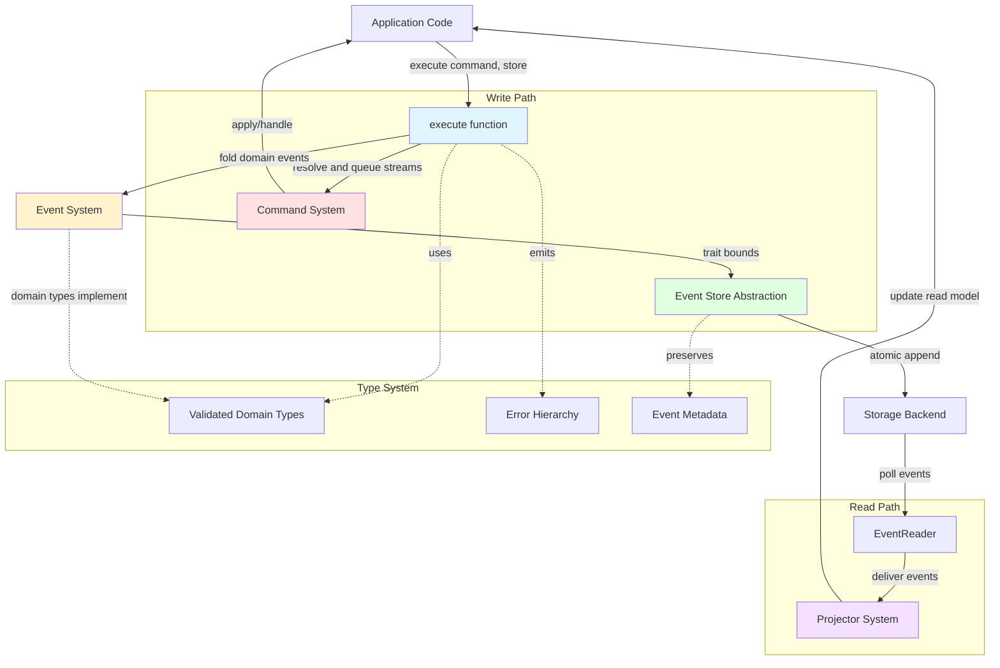
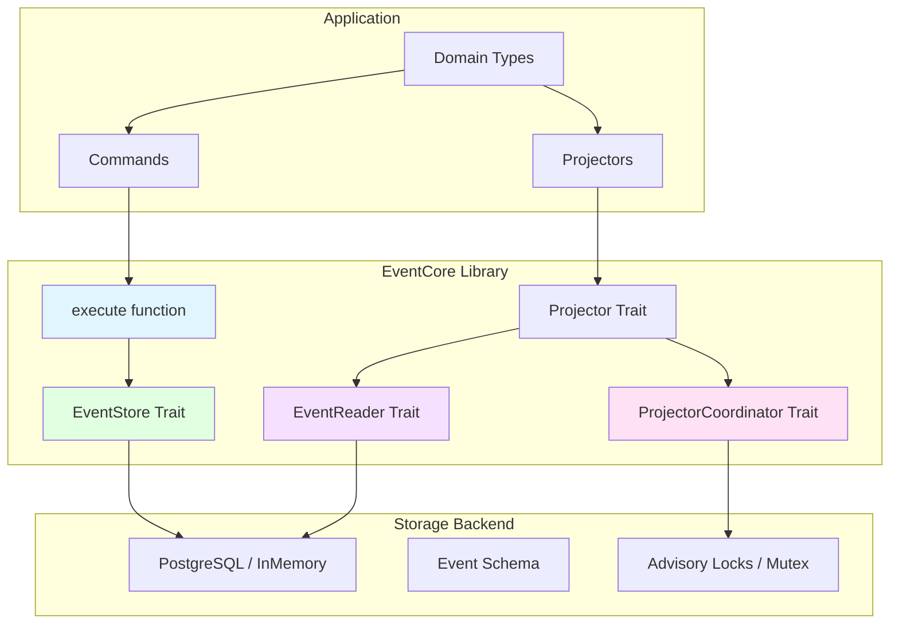

# EventCore Architecture

**Document Version:** 2.3
**Date:** 2025-12-20
**Phase:** 4 - Architecture Synthesis

## Overview

EventCore is a type-driven event sourcing library for Rust that delivers atomic multi-stream commands, optimistic concurrency, and first-class developer ergonomics. The library enables applications to execute business operations that span multiple event streams within a single atomic transaction, eliminating the need for complex saga patterns when immediate consistency is required.

The architecture follows a clear separation between infrastructure concerns (handled by the library) and domain concerns (implemented by applications). Commands define business operations, events capture state changes as immutable facts, and projections build read models from event streams.

## Architectural Principles

1. **Type-Driven Development** - All externally visible APIs express domain constraints in their signatures. Domain concepts use validated newtypes (StreamId, EventId, CorrelationId) constructed via smart constructors, ensuring "parse, don't validate" semantics. Phantom types and typestate patterns make illegal states unrepresentable. Total functions and structured errors replace panics.

2. **Correctness over Throughput** - Multi-stream atomicity, optimistic concurrency detection, and immutability are non-negotiable. Performance optimizations must preserve these guarantees and therefore happen within atomic transaction boundaries provided by the backing store.

3. **Infrastructure Neutrality** - The library owns infrastructure concerns (stream management, retries, metadata, storage abstraction) and never assumes a particular business domain. Applications own their domain events, metadata schemas, and business rules.

4. **Free-Function APIs** - Public entry points are free functions with explicit dependencies (`execute(command, store)`), keeping the API surface minimal and composable. Structs exist only when grouping configuration or results adds clarity.

5. **Developer Ergonomics** - The `#[derive(Command)]` macro generates all infrastructure boilerplate. Developers write only domain code (state reconstruction + business logic). Automatic retries, contract-test tooling, and in-memory storage support a "working command in 30 minutes" onboarding goal.

## Crate Organization

EventCore uses a multi-crate workspace designed for feature flag ergonomics while maintaining clean dependency boundaries.

### Workspace Structure

```
eventcore/                    (workspace root, virtual manifest)
  eventcore/                  (main crate - implementation + feature flags)
    Cargo.toml
    src/lib.rs               (execute(), InMemoryEventStore, retry logic, re-exports)
  eventcore-types/           (shared vocabulary - traits and types)
    Cargo.toml
    src/                     (EventStore trait, Event trait, StreamId, etc.)
  eventcore-macros/          (all macros: #[derive(Command)], require!)
  eventcore-postgres/        (PostgreSQL backend, depends on eventcore-types)
  eventcore-testing/         (dev-dependency testing utilities)
```

### Crate Responsibilities

| Crate | Purpose | Dependencies |
|-------|---------|--------------|
| `eventcore-types` | Shared vocabulary: traits (`EventStore`, `Event`, `CommandLogic`, `ProjectorCoordinator`) and types (`StreamId`, `StreamWrites`, errors) | Minimal |
| `eventcore` | Main entry point: `execute()`, `InMemoryEventStore`, `LocalCoordinator`, retry logic, re-exports from `eventcore-types` | `eventcore-types`, optionally `eventcore-postgres` via feature |
| `eventcore-macros` | Procedural macros: `#[derive(Command)]`, `require!` | syn, quote, proc-macro2 |
| `eventcore-postgres` | PostgreSQL backend implementing `EventStore`, `EventReader`, and `ProjectorCoordinator` | `eventcore-types`, sqlx |
| `eventcore-testing` | Contract tests (storage, reader, coordinator), chaos harness, test fixtures (dev-dependency) | `eventcore-types` |

### Feature Flag Ergonomics

Users enable storage adapters via feature flags on the main crate:

```toml
[dependencies]
eventcore = { version = "0.1", features = ["postgres"] }
```

The main crate re-exports enabled adapters:

```rust
pub use eventcore_types::*;

#[cfg(feature = "macros")]
pub use eventcore_macros::Command;

#[cfg(feature = "postgres")]
pub use eventcore_postgres as postgres;
```

This pattern matches the Rust ecosystem norm (tokio, sqlx, reqwest) while keeping heavy dependencies isolated in separate crates.

### Dependency Flow

```
eventcore-types  <--  eventcore-postgres
       ^                    |
       |                    | (via feature flag)
       +---  eventcore  <---+
                ^
                |
       eventcore-macros (feature gated)
```

The `eventcore-types` crate breaks potential circular dependencies by providing the shared vocabulary that both `eventcore` and adapter crates depend on.

## System Blueprint



## Event Store Abstraction

### Core Operations

The `EventStore` trait exposes two fundamental operations:

1. **Read Operations** - `read_stream` / `read_streams` fetch all events for one or more streams, returning both events and current stream versions.

2. **Append Operations** - `append_events` atomically registers new streams (if needed) and appends events to one or more streams while verifying expected versions.

### Multi-Stream Atomicity

Multi-stream atomicity is achieved by delegating to the backend's native transaction mechanism:

- PostgreSQL uses ACID transactions
- In-memory stores use mutex-protected synchronization
- Future backends may use other appropriate mechanisms

Append operations are "all-or-nothing" across every stream referenced in a command. Backend implementations hide their transaction mechanics; the trait merely promises atomic semantics. This design eliminates the need for complex saga patterns when business operations span multiple entities.

### Optimistic Concurrency Control

Version-based conflict detection ensures concurrent commands cannot corrupt state:

- Each stream tracks a monotonically increasing `StreamVersion` starting at 0
- Every appended event increments the version by 1
- During execution, the executor captures versions for each stream it reads
- `append_events` receives the map of expected versions and atomically verifies all of them
- A mismatch on any stream yields `EventStoreError::VersionConflict` (retriable)
- Version verification occurs inside the backend transaction to eliminate TOCTOU races

### Event Metadata

All persisted events carry immutable metadata:

| Field | Purpose |
|-------|---------|
| `EventId (UUIDv7)` | Globally ordered identity for cross-stream projections and debugging |
| `StreamId` and `StreamVersion` | Aggregate identity and per-stream ordering |
| `Timestamp` | Commit time (not command start time) |
| `CorrelationId` | Logical operation identifier (stable across retries) |
| `CausationId` | Immediate trigger of the event (usually the command) |
| `CustomMetadata<M>` | Application-defined, strongly typed metadata payload |

Metadata is validated at construction time, persisted verbatim by every backend, and never mutated after commit.

### Storage Implementations

- **InMemoryEventStore** ships inside the main crate with zero third-party dependencies. It is the default for tests, tutorials, and quickstarts.
- **Production backends** (e.g., PostgreSQL via `eventcore-postgres`) live in separate crates to avoid imposing heavy dependencies. They implement `EventStore` and, when applicable, `EventReader`.
- All implementations must support chaos testing hooks (e.g., injected conflicts) and optional instrumentation for observability.

### Contract Testing

A reusable contract test suite (`eventcore_testing::contract`) verifies that implementations:

- Detect version conflicts under concurrent writes (single and multi-stream scenarios)
- Enforce atomicity - either all streams are updated or none are
- Preserve metadata and ordering guarantees
- Classify errors correctly (retriable vs permanent)

Every backend (first-party or third-party) integrates these tests into its CI pipeline to guarantee semantic compliance. The contract test suite is provided by the `eventcore-testing` crate, which should be added as a dev-dependency to keep production builds lean.

## Event System

### Domain-First Event Trait

Domain events implement the simple `Event` trait:

```rust
pub trait Event: Clone + Send + 'static {
    fn stream_id(&self) -> &StreamId;
}
```

Key characteristics:

- Developers model events as plain structs with owned data
- The `'static` bound ensures events are self-contained values suitable for storage, async boundaries, and cross-thread movement
- StreamId represents aggregate identity - a domain concept, not purely infrastructure
- No infrastructure wrapper is required; domain types ARE events by implementing the trait

### Event Type Identity

Events carry type identity through the `EventTypeName` mechanism:

- Each event type has a string name (e.g., "MoneyDeposited")
- The Event trait provides `event_type_name()` and `all_type_names()` methods
- Type names enable filtering, routing, and cross-language interoperability

### StreamId Character Restrictions

StreamId values cannot contain glob metacharacters (`*`, `?`, `[`, `]`) to enable unambiguous future pattern matching in subscription queries. Valid identifiers include UUIDs, hierarchical paths (`tenant/account/123`), and composite keys (`order-2024-12-10-001`).

### Metadata Pipeline

- Standard metadata fields (IDs, versions, timestamps, tracing IDs) are handled by infrastructure when events are persisted
- Applications supply strongly typed custom metadata `M: Serialize + DeserializeOwned` to capture audit information (actors, IP addresses, etc.) without violating infrastructure neutrality
- Metadata records are immutable facts; changes require emitting compensating events rather than editing existing ones

## Command Model

### Macro-Generated Infrastructure

The `#[derive(Command)]` macro transforms annotated struct fields into full command infrastructure:

```rust
#[derive(Command)]
struct TransferMoney {
    #[stream]
    from_account: StreamId,
    #[stream]
    to_account: StreamId,
    amount: Money,
}
```

The macro produces:

- A phantom `StreamSet` type encoding the declared streams
- An implementation of `CommandStreams` that surfaces stream declarations to the executor
- Compile-time enforcement that only declared streams can be targeted via `StreamWrite<StreamSet, Event>` and the `emit!` macro

### CommandLogic Trait

Developers implement `CommandLogic` for domain behavior:

```rust
impl CommandLogic for TransferMoney {
    type State = AccountPairState;
    type Event = AccountEvent;

    fn apply(&self, state: Self::State, event: &Self::Event) -> Self::State {
        // Fold events into state
    }

    fn handle(&self, state: Self::State) -> Result<NewEvents<Self::Event>, CommandError> {
        require!(state.can_transfer(self.amount), "Insufficient funds");
        emit!(state.ctx, AccountDebited { /* ... */ });
        emit!(state.ctx, AccountCredited { /* ... */ });
        Ok(state.ctx.into())
    }

    fn stream_resolver(&self) -> Option<&dyn StreamResolver<Self::State>> {
        None
    }
}
```

- `apply` reconstructs state by folding historical events
- `handle` validates business rules and produces new domain events using the type-safe `emit!` helper
- `stream_resolver` is optional; commands needing runtime discovery return `Some(self)` (or another resolver)

### Dynamic Stream Discovery

When commands implement `StreamResolver<State>`, the executor uses a queue-based algorithm:

1. Seeds a `VecDeque<StreamId>` with statically declared streams
2. Maintains `scheduled` and `visited` hash sets to deduplicate work
3. Pops a stream ID, reads it exactly once, folds events, and records the stream's version
4. Invokes `discover_related_streams(&state)` to enqueue additional stream IDs discovered from reconstructed state
5. Continues until the queue is empty

This approach eliminates multi-pass re-read loops while ensuring both static and discovered streams participate in optimistic concurrency.

## Command Execution Pipeline

The primary API is the async free function `execute(command, store)`. Each attempt runs five deterministic phases:

1. **Stream Resolution** - Ask the command for its static stream declarations and seed the dynamic discovery queue.

2. **Read and Version Capture** - Drain the queue, reading each stream exactly once, folding events into state, and building the expected-version map.

3. **State Reconstruction** - After all required streams have been read, the accumulated state represents a consistent snapshot for the command.

4. **Business Logic** - Invoke `CommandLogic::handle`, producing `NewEvents` (potentially empty) or returning `CommandError` for validation/business rule failures.

5. **Atomic Append** - Write all emitted events using the captured expected versions. Any mismatch triggers `EventStoreError::VersionConflict`.

### Automatic Retry with Backoff

If Phase 5 returns a concurrency error:

- The executor consults the configurable `RetryPolicy` (max attempts, base delay, multiplier, optional jitter)
- After waiting for the computed backoff, execution restarts from Phase 2 with a fresh queue and state
- Correlation and causation IDs remain unchanged so tracing reflects a single logical operation
- Permanent errors (validation failures, business rule violations, non-retriable storage errors) short-circuit and return immediately with enriched context

### Metadata Continuity

- Correlation IDs are generated once per `execute` call and preserved across retries
- Causation IDs typically use the command identifier and never change
- Commit timestamps reflect when events are successfully persisted, not when execution began

### Observability Hooks

- Each phase emits structured logs and metrics (read durations, queue depth, retry counts, conflict rates)
- Backoff decisions expose telemetry for contention analysis
- Correlation/causation IDs tie command execution to surrounding telemetry

## Poll-Based Projections

### EventReader Trait

Read models are built using poll-based event retrieval:

```rust
pub trait EventReader {
    async fn read_events_after<E: Subscribable>(
        &self,
        query: SubscriptionQuery,
        after: Option<StreamPosition>,
        limit: usize,
    ) -> Result<Vec<(E, StreamPosition)>, EventStoreError>;
}
```

EventStore implementations that support projections implement this trait. The poll-based approach aligns control flow with transactional requirements - the projector controls when to fetch events, applies them transactionally, and checkpoints atomically.

### Subscribable Trait

The `Subscribable` trait enables type filtering for subscriptions:

```rust
pub trait Subscribable: Clone + Send + 'static {
    fn subscribable_type_names() -> Vec<EventTypeName>;
    fn try_from_stored(type_name: &EventTypeName, data: &[u8]) -> Result<Self, SubscriptionError>;
}
```

Key features:

- Blanket implementation for all Event types provides zero-cost adoption
- View enums can implement Subscribable directly without implementing Event
- Type name-based filtering distinguishes enum variants at the storage level
- `try_from_stored` returns Result for graceful schema evolution handling

### Projector Trait

Projections are built using the `Projector` trait:

```rust
pub trait Projector: Send + 'static {
    type Event: Subscribable;
    type Error: std::error::Error + Send;
    type Context;

    fn apply(
        &mut self,
        event: Self::Event,
        position: StreamPosition,
        ctx: &mut Self::Context
    ) -> Result<(), Self::Error>;

    fn on_error(&mut self, failure: FailureContext<Self::Event, Self::Error>) -> FailureStrategy {
        FailureStrategy::Fatal
    }

    fn after_apply(&mut self, event: &Self::Event, ctx: &Self::Context) -> Result<(), Self::Error> {
        Ok(())
    }

    fn name(&self) -> &str;
}
```

The trait provides:

- **apply()** - Updates the read model for a single event within the provided context
- **on_error()** - Returns failure strategy (Fatal, Skip, or Retry) when projection fails
- **after_apply()** - Lifecycle hook for side effects like notifications and metrics

### Integrated Checkpoint Management

Checkpoints are managed within the projection transaction, not as a separate concern:

- Projector implementations control checkpoint persistence
- Checkpoint updates happen atomically with read model updates
- The `Context` type parameter enables transactional coordination (e.g., database transaction handle)

This design eliminates the coordination problems of separate checkpoint management.

### Projection Execution Loop

The projector execution follows a simple pattern with required coordination:

```rust
guard = coordinator.acquire(projector.name())
while guard.is_valid() {
    guard.heartbeat()
    events = poll_events_after(checkpoint)
    for event in events {
        apply_event_in_transaction(event)
        update_checkpoint_atomically(event.position)
    }
    sleep_if_no_events()
}
// guard dropped - leadership released
```

The coordinator is a required parameter to the projection runner, ensuring that distributed deployments cannot accidentally run uncoordinated projectors.

### Projector Configuration

The projection runner accepts per-projector configuration for three distinct concerns. Each concern has different units, different defaults, and different operational meaning - they are orthogonal and should not be conflated.

#### Poll Configuration (Infrastructure Level)

Configuration for the polling loop itself:

- **poll_interval** - Duration between successful polls that returned events (default: 100ms)
- **empty_poll_backoff** - Duration to wait when poll returns no events (default: 1 second, configurable backoff strategy)
- **poll_failure_backoff** - Backoff strategy when `read_events_after()` fails (default: exponential, 100ms base, 30s max)
- **max_consecutive_poll_failures** - After this many failures, projector gives up and exits (default: 10, or "infinite" for never give up)

These parameters control how the projector interacts with the event store when there are no events to process or when infrastructure is degraded. Poll failures are about the polling mechanism itself (database connection errors, network timeouts, transient unavailability during failover), not about processing any particular event.

A projector that cannot reach the event store indefinitely is not useful. At some point, it should exit and let the orchestration layer (Kubernetes, systemd) restart it. "Infinite" mode is available for projectors in environments without orchestration.

#### Event Retry Configuration (Application Level)

See the Error Handling Strategies section for event retry configuration details.

#### Heartbeat Configuration (Coordination Level)

See the Heartbeat and Liveness Detection section under Projector Coordination for heartbeat configuration details.

#### Per-Projector Tuning

Different projectors have different characteristics:

- A real-time notification projector needs sub-second poll intervals and tight liveness detection
- A daily reporting projector might poll every minute with relaxed heartbeat intervals
- A projector doing expensive external API calls needs longer event retry delays
- A projector updating critical financial data prioritizes correctness over speed

Per-projector configuration lets each projector match its operational profile rather than forcing all projectors to the lowest common denominator. Configuration uses builder pattern with sensible defaults - most projectors work with zero configuration.

### Error Handling Strategies

Three strategies are available for projection failures:

- **Fatal (Default)** - Stop immediately, prevent silent projection drift. This is the safe default requiring zero configuration.

- **Skip** - Log the error and continue to next event. Use for non-critical projections that can tolerate gaps (caches, dashboards, notifications).

- **Retry** - Retry with configurable backoff for transient failures.

The default Fatal behavior ensures applications fail fast rather than silently drift. Skip and Retry require explicit opt-in, documenting the application's tolerance for gaps or retries.

#### Event Retry Configuration

When `on_error()` returns `FailureStrategy::Retry`, the retry behavior is controlled by event retry configuration:

- **max_retry_attempts** - Maximum retries before escalating to Fatal (default: 3)
- **retry_delay** - Initial delay between retries (default: 100ms)
- **retry_backoff_multiplier** - Multiplier for subsequent retry delays (default: 2.0)
- **max_retry_delay** - Cap on retry delay (default: 5 seconds)

The `on_error()` callback decides WHETHER to retry; the configuration controls HOW retries behave. This separation lets projector implementations focus on failure classification while operational concerns like retry timing are tuned per deployment.

### Ordering Preservation

All error handling strategies preserve temporal ordering:

- **Fatal**: Stops stream, no further processing
- **Skip**: Skips current event, continues to next in order (gap, not reorder)
- **Retry**: Retries current event, blocks subsequent events

This is a hard constraint: events are never processed out of order.

### Projector Coordination for Distributed Deployments

Production systems typically run multiple application instances for availability and load distribution. The `ProjectorCoordinator` trait ensures correct operation by providing leader election for projectors.

```rust
pub trait ProjectorCoordinator: Send + Sync + 'static {
    type Guard: CoordinatorGuard;

    /// Attempt to acquire leadership for the named projector.
    /// Returns a guard that releases leadership when dropped.
    async fn acquire(&self, projector_name: &str) -> Result<Self::Guard, CoordinationError>;
}

pub trait CoordinatorGuard: Send + 'static {
    /// Check if leadership is still held (including heartbeat validity).
    fn is_valid(&self) -> bool;

    /// Renew leadership by updating heartbeat.
    fn heartbeat(&self) -> Result<(), CoordinationError>;
}
```

Key design principles:

- **Required Parameter**: The projection runner requires a coordinator. This makes coordination failures compile-time errors rather than production incidents. Single-process deployments use an explicit `LocalCoordinator` rather than having "no coordination" as an invisible default.

- **RAII Guard Pattern**: Leadership acquisition returns a guard that releases leadership when dropped. This ensures crash safety: if the process terminates unexpectedly, leadership is released automatically (via database connection close, process termination, etc.).

- **Leadership Validity Checking**: Guards must be checkable for continued validity. Leadership can be lost unexpectedly due to network partitions or database failover. The projection loop exits gracefully when leadership is lost rather than corrupting state.

- **Backend-Specific Implementations**:
  - PostgreSQL uses session-scoped advisory locks (released automatically on disconnect)
  - In-memory uses process-local mutexes (for testing and single-process deployments)
  - Future backends use their natural primitives

#### LocalCoordinator for Single-Process

A coordinator implementation that always grants leadership immediately. Usage is explicit, making "I am running single-process and accept the risks" a deliberate choice:

```rust
let coordinator = LocalCoordinator::new();
run_projector(projector, event_reader, coordinator).await;
```

#### Why Leader Election, Not Partition Assignment

Sequential processing (a hard constraint for ordering preservation) eliminates the need for partition assignment. The question is not "which instance processes which subset of events" but rather "which single instance processes events for this projector."

For users who need Kafka-style partition-based scaling, an escape hatch exists: create a single-threaded projector that pushes events onto a Kafka (or similar) log, then let that external system handle partitioning and parallel consumption. EventCore handles the leader-elected, sequential projection to the external system; that external system provides the partition assignment semantics.

#### Heartbeat and Liveness Detection

Heartbeat configuration is part of ProjectorCoordinator because liveness is a coordination concern, not a projection concern:

- **heartbeat_interval** - How often the leader must renew leadership (default: 5 seconds)
- **heartbeat_timeout** - How long before missed heartbeat causes leadership loss (default: 15 seconds, must be > heartbeat_interval)

The projection runner calls `guard.heartbeat()` periodically. The coordinator implementation decides what that means (e.g., updating a timestamp in the checkpoint table, renewing an advisory lock with timeout). Guard validity (`guard.is_valid()`) returns false if heartbeat has been missed, causing the projection loop to exit gracefully.

Heartbeat timeout should be 2-3x the heartbeat interval to tolerate transient delays (network jitter, GC pauses) while still detecting truly hung projectors. A hung projector (infinite loop, deadlock, network partition with connection alive) would otherwise block failover indefinitely since the advisory lock remains held.

Backend implementations use their natural primitives:
- PostgreSQL can use `pg_advisory_lock` with timeout, or update a timestamp column
- In-memory can use tokio timeout on mutex
- External coordinators (etcd, Consul) have built-in TTL mechanisms

#### Contract Tests for Coordinators

Per the contract testing pattern, coordinators have contract tests verifying:

- Mutual exclusion (only one leader at a time)
- Crash-safe release (leadership released when connection drops)
- Blocking/non-blocking acquisition semantics
- Guard validity detection after leadership loss
- Heartbeat timeout enforcement

## Type System Patterns

### Validated Newtypes

Domain types use the `nutype` crate for validation at boundaries:

- `StreamId`, `EventId`, `CorrelationId`, `Money` enforce invariants at construction time
- Construction returns Result types with descriptive errors
- Types implement standard traits (Debug, Clone, Serialize, AsRef)

### Phantom Types and Typestate

- `StreamWrite<StreamSet, Event>` enforces compile-time stream access control
- `NewEvents` carries the same phantom to ensure only declared streams receive emissions
- The macro generates phantom types that make illegal stream access unrepresentable

### Total Functions

- Public APIs return `Result` instead of panicking
- Error enums derive `thiserror` and support pattern matching
- No `unwrap()` or `expect()` in library code

### Trait Composition

Narrow traits keep responsibilities focused:

- `CommandStreams` - Stream declarations (generated by macro)
- `CommandLogic` - Business logic (implemented by developers)
- `StreamResolver` - Dynamic stream discovery (optional)
- `EventStore` - Storage operations (implemented by backends)
- `EventReader` - Event polling for projections
- `Projector` - Read model construction
- `ProjectorCoordinator` - Leader election for distributed deployments

## Error Handling

### Error Categories

- **CommandError** - Categorizes domain failures (validation, business rule violations, infrastructure issues surfaced to commands). Business rule violations are permanent by design.

- **EventStoreError** - Represents storage-layer failures (version conflicts, connectivity, serialization). Version conflicts map to `ConcurrencyError` and are retriable.

- **ValidationError** - Raised by newtype constructors and automatically bubbled up through `CommandError`.

- **SubscriptionError** - Covers projection failures (deserialization, unknown event types).

- **CoordinationError** - Represents coordination failures (leadership acquisition failure, lost leadership, backend communication errors).

### Retry Classification

Errors implement marker traits indicating whether they are retriable or permanent:

- **Retriable**: ConcurrencyError, network timeouts
- **Permanent**: Validation errors, business rule violations, schema errors

The executor and projector consult this classification before attempting retries.

### Context Enrichment

Errors carry diagnostic information:

- Correlation ID and Causation ID for distributed tracing
- Stream identifiers and operation context
- Detailed messages without sensitive data exposure

## Reference Implementations and Tooling

### InMemoryEventStore and LocalCoordinator

Included in `eventcore` with zero third-party dependencies:

- **InMemoryEventStore**: Full EventStore and EventReader implementation for testing and development
- **LocalCoordinator**: Process-local mutex-based coordination for single-instance deployments
- Optional chaos hooks (ConflictOnceStore, CountingEventStore)
- Full contract test compliance for both storage and coordination

### External Backends

Production backends (e.g., `eventcore-postgres`) implement the same traits:

- Full EventStore and EventReader support
- ProjectorCoordinator implementation using backend-native primitives
- Contract test suite integration in CI (storage, reader, and coordinator)
- Additional observability and operational features

### Testing Utilities

The `eventcore-testing` crate provides:

- Contract test suite for EventStore implementations
- Projector contract tests for EventReader implementations
- Coordinator contract tests for ProjectorCoordinator implementations
- Property-based testing helpers
- Integration scenario utilities

## Deployment Architecture



### Single-Process Deployment

For simpler deployments:

- InMemoryEventStore for development and testing
- Single projector instance per projection type
- LocalCoordinator for explicit single-process opt-in

### Production Deployment

For production systems:

- PostgreSQL backend with ACID guarantees
- PostgreSQL advisory locks for projector coordination (via `PostgresCoordinator`)
- Multiple application instances for availability - projectors automatically elect leaders
- Contract tests verify backend and coordinator compliance
- Observability via structured logging and metrics

### Dependency Configuration

Users configure storage backends via feature flags:

```toml
# Development/testing (default)
[dependencies]
eventcore = "0.1"

# Production with PostgreSQL
[dependencies]
eventcore = { version = "0.1", features = ["postgres"] }

# With macros (default, can be disabled)
eventcore = { version = "0.1", default-features = false }
```

Third-party adapter implementations depend on `eventcore-types` rather than the full `eventcore` crate, keeping their dependency footprint minimal.

## Quality Attributes

### Correctness

- Multi-stream atomicity via storage-native transactions
- Optimistic concurrency with version checking
- Contract tests verify semantic compliance
- Type system prevents invalid states

### Performance

- Read-heavy workloads scale via event store read replicas
- Write operations bounded by backend transaction capacity
- Poll-based projections control their own processing cadence
- Exponential backoff reduces contention under concurrent load

### Maintainability

- Clear separation between infrastructure and domain code
- Macro-generated boilerplate keeps domain code clean
- Contract tests enable confident backend evolution
- Comprehensive error context aids debugging

### Extensibility

- Pluggable storage backends via EventStore trait
- Custom projections via Projector trait
- Application-defined event metadata
- Optional StreamResolver for dynamic discovery
- Adapter crates depend only on `eventcore-types`, enabling independent development

## Summary

EventCore provides a cohesive architecture for event-sourced applications:

1. **Type-safe domain modeling** with zero boilerplate for infrastructure
2. **Deterministic, atomic execution** of complex multi-stream business operations
3. **Automatic concurrency management** and retry behavior that keeps business code simple
4. **Poll-based projections** with integrated checkpoint management for correct read models
5. **Distributed deployment support** via ProjectorCoordinator for leader election with heartbeat-based liveness detection
6. **Per-projector configuration** with three orthogonal concerns: poll (infrastructure), event retry (application), and heartbeat (coordination)
7. **Rich metadata and observability** hooks for auditing, compliance, and debugging
8. **Pluggable storage backends** validated by a shared contract suite
9. **Feature flag ergonomics** for adapter configuration matching Rust ecosystem patterns

This document is the single source of truth for EventCore's architecture and serves as the working reference for all implementation work.
