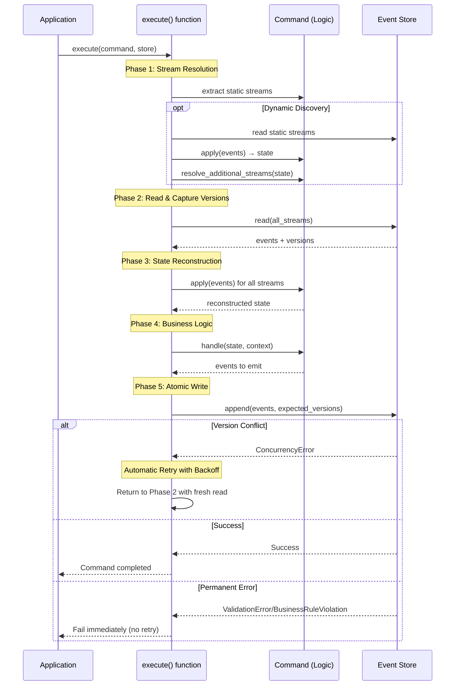
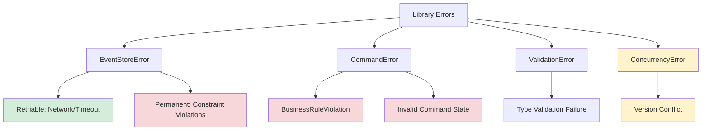

# EventCore Architecture

**Document Version:** 1.0
**Date:** 2025-10-13
**Phase:** 4 - Architecture Synthesis

## Overview

EventCore is a type-safe event sourcing library for Rust that implements **multi-stream event sourcing with dynamic consistency boundaries**. Unlike traditional event sourcing frameworks that enforce rigid aggregate boundaries, EventCore enables commands to atomically read from and write to multiple event streams, allowing developers to define consistency boundaries that match their business requirements rather than technical constraints.

**Target Audience:** Rust developers building event-sourced systems who need strong consistency guarantees across related business entities without the complexity of sagas or process managers.

**Core Value Proposition:** EventCore eliminates the artificial constraints of traditional event sourcing by enabling atomic multi-stream operations while maintaining type safety, strong consistency guarantees, and developer ergonomics through code generation.

## Architectural Principles

EventCore's architecture is guided by five foundational principles that inform all design decisions:

### 1. Type-Driven Development

The type system enforces domain constraints and prevents illegal states at compile time (ADR-003):

- **Parse, Don't Validate**: Domain types validate at construction time using `nutype`, guaranteeing validity thereafter
- **No Primitive Obsession**: All domain concepts use validated newtypes (StreamId, EventId, etc.)
- **Total Functions**: All public APIs use Result types; no unwrap/expect in library code
- **Making Illegal States Unrepresentable**: Phantom types and typestate patterns prevent invalid operations at compile time

### 2. Correctness Over Performance

Multi-stream atomicity and consistency are non-negotiable (ADR-001):

- Atomic operations across multiple streams using storage-native transactions
- Optimistic concurrency control ensures no lost updates
- All events written or none - no partial state updates
- Version conflicts detected 100% of the time
- Performance optimizations must work within correctness constraints

### 3. Infrastructure Neutrality

EventCore is library infrastructure, not business framework:

- No assumptions about business domains (no "users", "actors", etc.)
- Applications define domain-specific metadata structures
- Pluggable storage backends via trait abstraction
- Async runtime agnostic (Tokio, async-std)
- Minimal opinionated dependencies

### 4. Free Function API Design

Public API consists primarily of free functions, not methods on structs (ADR-010):

- **Minimal API Surface**: Types remain private until compiler requires public exposure
- **Composability**: Free functions enable function composition, partial application, easier testing
- **Explicit Dependencies**: All inputs visible in signatures - no hidden state
- **Compiler-Driven Evolution**: Types made public only when compiler or tests force it
- **Clear Data Flow**: Parameter passing makes ownership and data dependencies explicit

### 5. Developer Ergonomics

Minimize boilerplate while maximizing type safety (ADR-006):

- `#[derive(Command)]` macro eliminates infrastructure code
- Automatic retry on version conflicts - zero manual retry logic
- Compile-time safety prevents runtime errors
- Clear separation between infrastructure and business logic
- Developers write only domain-specific code

## Core Architecture

EventCore's architecture comprises six major components that work together to provide multi-stream event sourcing with type safety and automatic concurrency control.

### Component Overview

```mermaid
graph TB
    App[Application Code]
    ExecFn[execute() function]
    Cmd[Command System]
    Store[Event Store Abstraction]
    Backend[Storage Backend]

    App -->|"execute(command, store)"| ExecFn
    ExecFn -->|"extract streams"| Cmd
    ExecFn -->|"read/append events"| Store
    Store -->|"ACID transactions"| Backend
    Cmd -->|"apply/handle"| App

    subgraph "Type System"
        Types[Validated Domain Types]
        Errors[Error Hierarchy]
        Meta[Event Metadata]
    end

    ExecFn -.->|"uses"| Types
    ExecFn -.->|"produces"| Errors
    Store -.->|"preserves"| Meta

    style ExecFn fill:#e1f5ff
    style Store fill:#e1ffe1
    style Cmd fill:#ffe1e1
```

### 1. Event Store Abstraction (ADR-002)

**Purpose:** Pluggable storage abstraction supporting atomic multi-stream operations.

**Core Operations:**

- **Read**: Query events from one or more streams
- **Atomic Append**: Write events to multiple streams atomically with version checking

**Key Characteristics:**

- Atomicity mechanisms internal to backend implementations (PostgreSQL ACID, in-memory locks)
- Version-based optimistic concurrency control (ADR-007)
- Metadata preservation for audit and tracing (ADR-005)
- Separate EventSubscription trait for projection building

**Storage Backend Examples:**

- `eventcore-postgres`: Production backend using PostgreSQL ACID transactions
- `eventcore-memory`: In-memory backend for testing with optional chaos injection

**Why This Design:** Pushes atomicity complexity into battle-tested storage layers where it belongs, keeping library code simple while enabling backend flexibility.

### 2. Command System (ADR-006)

**Purpose:** Declarative command definition with compile-time stream access control.

**Components:**

**Command Macro (`#[derive(Command)]`):**

- Generates infrastructure boilerplate from `#[stream]` field attributes
- Creates phantom types for compile-time stream tracking
- Implements CommandStreams trait (infrastructure)
- Enables `emit!` macro for type-safe event emission

**CommandStreams Trait (Macro-Generated):**

- Extracts stream IDs from command fields
- Manages phantom types for compile-time access control
- Pure infrastructure - no business logic

**CommandLogic Trait (Developer-Implemented):**

- `apply(state, event)`: Reconstruct state from event history
- `handle(state, context)`: Validate business rules and produce events
- Domain-specific logic only

**StreamResolver Trait (Optional, ADR-009):**

- `resolve_additional_streams(state)`: Discover streams at runtime based on state
- Enables state-dependent stream requirements (payment processing, order fulfillment)
- Integrates with static declarations for hybrid static/dynamic stream sets

**Why This Design:** Clear separation between infrastructure (generated) and business logic (hand-written) minimizes boilerplate while maintaining compile-time safety. Optional dynamic discovery provides flexibility without compromising common-case simplicity.

### 3. Command Execution (ADR-008, ADR-010)

**Purpose:** Orchestrate command execution with automatic retry on version conflicts via free function API.

**API Design (ADR-010):**

EventCore provides command execution through a free function, not a struct method:

```rust
// Public API: free function with explicit dependencies
pub async fn execute<C, S>(
    command: C,
    store: &S,
) -> Result<ExecutionResponse, CommandError>
where
    C: CommandLogic + CommandStreams,
    S: EventStore,
```

**Why Free Functions:**

- **Explicit Dependencies**: Store passed as parameter, making data flow clear
- **Composability**: Function can be wrapped, partially applied, composed with combinators
- **Minimal API Surface**: No CommandExecutor struct to learn or manage
- **Testability**: Mock dependencies passed explicitly, no struct lifecycle concerns
- **Compiler-Driven Types**: Supporting types made public only when compiler requires it

**Execution Flow:**



**Retry Logic:**

- Automatic retry on ConcurrencyError (version conflicts)
- Exponential backoff reduces contention (10ms, 20ms, 40ms, ...)
- Configurable max attempts and backoff strategy
- Re-reads streams on every retry for fresh state
- Metadata (correlation/causation) preserved across retries
- Permanent errors fail immediately without retry

**Why This Design:** Centralizes infrastructure concerns (retry, orchestration) in the execute function, keeping command implementations focused on business logic. Automatic retry provides correctness guarantees without developer intervention. Free function API maximizes composability and minimizes learning curve.

### 4. Type System (ADR-003)

**Purpose:** Enforce domain constraints and prevent illegal states at compile time.

**Patterns:**

**Validated Domain Types:**

- `StreamId`, `EventId`, `CorrelationId`, `CausationId` - all validated newtypes using `nutype`
- Construction returns Result with descriptive validation errors
- Types guarantee validity after construction (parse, don't validate)

**Phantom Types:**

- Compile-time stream access control in commands
- `StreamWrite<StreamSet, Event>` prevents writing to undeclared streams
- Zero runtime cost (erased by compiler)

**Total Functions:**

- All public APIs return Result types
- No unwrap/expect in library code
- Error paths explicit in signatures

**Why This Design:** Leverages Rust's type system to catch entire classes of errors at compile time, reducing runtime failures and improving reliability.

### 5. Error Handling (ADR-004)

**Purpose:** Structured errors enabling programmatic handling and automatic retry classification.

**Error Hierarchy:**



**Error Classification:**

- **Retriable Errors**: ConcurrencyError, network timeouts → automatic retry
- **Permanent Errors**: ValidationError, BusinessRuleViolation → immediate failure

**Error Context:**

- Correlation ID: Links related operations across command executions
- Causation Chain: Tracks causal relationships between commands and events
- Operation Context: Stream IDs, command type, diagnostic information

**Why This Design:** Classification enables automatic retry logic in executor. Rich context supports debugging and distributed tracing without losing root cause information.

### 6. Event Metadata (ADR-005)

**Purpose:** Structured, immutable metadata for audit, tracing, and event ordering.

**Standard Metadata Fields:**

| Field          | Type          | Purpose                                    |
| -------------- | ------------- | ------------------------------------------ |
| Event ID       | UUIDv7        | Globally unique, time-ordered identifier   |
| Stream ID      | StreamId      | Stream this event belongs to               |
| Stream Version | u64           | Position within stream (monotonic)         |
| Timestamp      | DateTime      | Commit time (not command initiation)       |
| Correlation ID | CorrelationId | Groups events from same business operation |
| Causation ID   | CausationId   | Identifies immediate cause (command/event) |

**Custom Metadata:**

- Generic type parameter `M: Serialize + DeserializeOwned`
- Applications define domain-specific metadata structures
- Type-safe extension point maintaining ADR-003 principles
- Examples: actor attribution, tenant IDs, compliance data

**Immutability Guarantee:**

- Once committed, metadata never changes
- Storage backends enforce integrity (constraints, append-only)
- Audit trail integrity for compliance

**Why This Design:** Standard infrastructure fields (correlation, causation, ordering) built-in for consistency. Generic custom metadata maintains type safety while avoiding business domain assumptions.

## Key Workflows

### Multi-Stream Command Execution

The complete command execution workflow demonstrates how all components integrate:

**1. Command Definition (Developer Code):**

```rust
#[derive(Command)]
struct TransferMoney {
    #[stream]
    from_account: StreamId,
    #[stream]
    to_account: StreamId,
    amount: Money,
}

impl CommandLogic for TransferMoney {
    type State = (Account, Account);
    type Event = AccountEvent;

    fn apply(&self, mut state: Self::State, event: &Self::Event) -> Self::State {
        // Reconstruct state from events
        // (Details omitted - focus on architecture)
        state
    }

    fn handle(&self, state: Self::State, ctx: Context) -> Result<(), CommandError> {
        let (from, to) = state;

        // Business logic with validation
        require!(from.balance >= self.amount, "Insufficient funds");

        // Type-safe event emission to declared streams
        emit!(ctx, self.from_account, AccountDebited { amount: self.amount });
        emit!(ctx, self.to_account, AccountCredited { amount: self.amount });

        Ok(())
    }
}
```

**2. Execution Flow (Infrastructure via execute() function):**

```rust
// Application invokes free function with command and store
let response = execute(transfer_command, &event_store).await?;
```

- **Phase 1 - Stream Resolution:** Extract `from_account` and `to_account` stream IDs
- **Phase 2 - Read with Version Capture:** Read both streams, capture versions (e.g., version 42, 17)
- **Phase 3 - State Reconstruction:** Apply events through `apply()` to build `(Account, Account)` state
- **Phase 4 - Business Logic:** Invoke `handle()` which validates balance and produces debit/credit events
- **Phase 5 - Atomic Write:** Write both events atomically with version expectations (43, 18)
  - If another command modified either stream: ConcurrencyError → retry from Phase 2
  - If versions match: commit both events atomically, transaction succeeds

**3. Automatic Retry on Conflict:**

If concurrent command committed to `from_account` between read and write:

- ConcurrencyError returned by EventStore
- execute() function applies exponential backoff (10ms first retry)
- Return to Phase 2: re-read both streams with fresh versions
- Re-execute business logic with updated state
- Retry atomic write with new version expectations
- Repeat until success or max retries exceeded

### Dynamic Stream Discovery Workflow (ADR-009)

For commands with runtime-determined stream dependencies:

**1. Command with Discovery:**

```rust
#[derive(Command)]
struct ProcessPayment {
    #[stream]
    order: StreamId,
    // Payment streams discovered based on order state
}

impl StreamResolver for ProcessPayment {
    fn resolve_additional_streams(&self, state: &Order) -> Result<Vec<StreamId>> {
        // Examine order state to determine payment method
        match state.payment_method {
            PaymentMethod::CreditCard(id) => Ok(vec![credit_card_stream(id)]),
            PaymentMethod::Wallet(id) => Ok(vec![wallet_stream(id)]),
        }
    }
}
```

**2. Discovery Flow:**

- **Initial Read:** Read `order` stream, reconstruct Order state
- **Discovery:** Call `resolve_additional_streams(order_state)` → returns payment stream IDs
- **Incremental Re-Read:**
  - Order stream: read from last captured version + 1 (incremental)
  - Payment streams: read from version 0 (full history)
- **State Reconstruction:** Apply events from all streams (order + payment)
- **Multi-Pass Support:** If resolver returns new streams, repeat discovery
- **Deduplication:** Set-based tracking prevents re-reading same stream twice
- **Business Logic:** Execute with complete state from all discovered streams
- **Atomic Write:** All streams (static + discovered) participate in version checking

**Why Incremental Reading:** Events are immutable - already-read events remain valid. Reading only new events from previously-read streams dramatically reduces I/O in multi-pass scenarios.

### Retry on Version Conflict

Optimistic concurrency control workflow:

**1. Concurrent Execution Scenario:**

- Command A reads account stream at version 10
- Command B reads account stream at version 10
- Command B completes first, writes event, advances to version 11
- Command A attempts write expecting version 11, finds version 12 (conflict)

**2. Conflict Detection:**

- EventStore atomically verifies expected version (11) matches current (12)
- Version mismatch detected before any write occurs
- ConcurrencyError returned with diagnostic context

**3. Automatic Retry:**

- execute() function classifies ConcurrencyError as Retriable
- Apply exponential backoff delay (10ms)
- Return to read phase with fresh read
- Command A re-reads account stream at version 12
- Re-execute business logic with updated state
- Attempt write with new expected version (13)
- Success if no new conflicts

**Why This Works:** Fresh state ensures business logic operates on current information. Version checking prevents lost updates. Exponential backoff reduces contention on retry.

## Cross-Cutting Concerns

### Atomicity Across Components

Multi-stream atomicity permeates the entire architecture:

- **Event Store:** Leverages storage-native transactions (PostgreSQL ACID) for atomic multi-stream appends
- **execute() function:** Coordinates reads and writes ensuring all streams participate in version checking
- **Dynamic Discovery:** Discovered streams fully integrated into atomic write operation
- **Retry Logic:** Failed attempts retry entire flow, maintaining atomicity invariants

**Guarantee:** All events across all streams (static and discovered) written atomically, or none written. No partial state updates possible.

### Type Safety Throughout

Type-driven development enforced across all components:

- **Domain Types:** StreamId, EventId, Money - all validated at construction via `nutype`
- **Phantom Types:** Compile-time stream access control in commands
- **Error Types:** Structured errors with classification (Retriable/Permanent)
- **Generic Metadata:** Type-safe application extension without primitive obsession
- **Total Functions:** Result types throughout public API

**Benefit:** Large classes of bugs prevented at compile time, not discovered in production.

### Metadata Flow

Correlation and causation provide distributed tracing throughout execution:

- **Command Invocation:** execute() function generates/receives correlation ID for operation
- **Event Emission:** Events carry correlation and causation IDs from context
- **Retry Preservation:** Same correlation ID across all retry attempts
- **Event Storage:** Metadata persisted atomically with events
- **Projection Building:** Projections can reconstruct operation flows via correlation chains

**Use Cases:** Distributed tracing (OpenTelemetry), audit trails, debugging complex multi-stream operations.

### Error Propagation Strategy

Errors flow through layers with context accumulation:

- **Command Logic:** BusinessRuleViolation with rule context
- **execute() function:** Adds command type, stream IDs, retry attempt count
- **Event Store:** Maps backend errors to EventCore types, preserves backend details in error chain
- **Application:** Receives fully-contextualized error for logging, monitoring, user feedback

**Classification Enforcement:** execute() function respects Retriable/Permanent distinction - only ConcurrencyError triggers retry.

## Quality Attributes

### Correctness Guarantees

**Multi-Stream Atomicity:**

- All events written or none - no partial updates
- Achieved via storage-native transactions (PostgreSQL ACID)
- Extends to dynamically discovered streams

**Optimistic Concurrency Control:**

- Version conflicts detected 100% of the time
- Atomic version checking prevents time-of-check-to-time-of-use races
- No lost updates possible

**Type Safety:**

- Illegal states unrepresentable at compile time
- Validated domain types prevent invalid data
- Total functions ensure explicit error handling

### Performance Characteristics

**Performance Goals:**

EventCore's architecture prioritizes correctness over raw throughput, with performance goals that reflect real-world business operation requirements:

**Target Latency (Under Normal Load):**

- Single-stream commands: <50ms P95 (typical user operation response time requirement)
- Multi-stream commands: <100ms P95 (reflects additional coordination overhead)
- Batch operations: Sub-second for 1000+ events (bulk processing efficiency)

**Throughput Expectations:**

- Low contention scenarios: Hundreds of commands/second per instance (typical business workload)
- Moderate contention: Automatic retry maintains throughput with increased latency
- High contention: Stream partitioning and application design required for scale

**Scalability Characteristics:**

- Horizontal scaling via read replicas for read-heavy projections
- Vertical scaling for write throughput (limited by storage backend transaction capacity)
- Stream-level parallelism (different streams = concurrent execution)
- Command-level parallelism (optimistic concurrency allows concurrent attempts)

**Design Trade-offs:**

- Correctness guaranteed even under extreme contention (no shortcuts)
- Multi-stream atomicity maintained at all scales (no degradation)
- Performance optimization within correctness constraints (caching, batching, read replicas)
- Exponential backoff reduces contention on retry (prioritizes success over immediate completion)

**Contention Management:**

- Exponential backoff with jitter prevents thundering herd
- Hot stream detection enables targeted optimization (partitioning, caching)
- Configurable retry policies adapt to application-specific contention patterns
- Circuit breakers (future) for sustained high-conflict scenarios

### Developer Experience

**Minimal Boilerplate:**

- `#[derive(Command)]` eliminates infrastructure code
- Developers write only `apply()` and `handle()` methods
- Automatic retry - zero manual retry logic
- Typical command: <50 lines of code

**Compile-Time Safety:**

- Invalid stream access caught by compiler
- Type errors provide clear guidance
- `emit!` macro ensures type-safe event emission

**Clear Error Messages:**

- Structured errors with actionable context
- Version conflicts identify which streams conflicted
- Business rule violations explain which rule failed

### Extensibility

**Storage Backends:**

- EventStore trait enables custom backends
- PostgreSQL and in-memory implementations provided
- Community backends possible (SQLite, EventStoreDB, etc.)

**Custom Metadata:**

- Generic type parameter for application-specific metadata
- Type-safe extension without framework assumptions
- Supports domain-specific audit, compliance, analytics

**Retry Policies:**

- Configurable max attempts, backoff strategy
- Custom policies for specific command types
- Circuit breakers for sustained contention

**Dynamic Discovery:**

- StreamResolver trait for runtime stream determination
- Supports complex state-dependent workflows
- Optional - simple commands remain simple

## Deployment Architecture

EventCore is a library, not a framework - deployment is application-controlled:

### Typical Production Deployment

```mermaid
graph TB
    subgraph "Application Layer"
        WebAPI[Web API<br/>Axum/Actix]
        BgWorker[Background Workers]
    end

    subgraph "EventCore Library"
        ExecFn[execute() function]
        Store[EventStore Trait]
    end

    subgraph "Storage Layer"
        PG[(PostgreSQL<br/>ACID Transactions)]
    end

    subgraph "Projection Layer"
        Proj1[Read Model 1]
        Proj2[Read Model 2]
        ProjStore[(Projection Store)]
    end

    WebAPI --> ExecFn
    BgWorker --> ExecFn
    ExecFn --> Store
    Store --> PG

    PG -.->|Event Subscription| Proj1
    PG -.->|Event Subscription| Proj2
    Proj1 --> ProjStore
    Proj2 --> ProjStore

    style ExecFn fill:#e1f5ff
    style Store fill:#e1ffe1
    style PG fill:#d4edda
```

**Components:**

- **Web API:** Commands received from HTTP requests, executed via execute() function
- **Background Workers:** Long-running processes executing scheduled commands via execute() function
- **PostgreSQL:** Production event store with ACID transactions
- **Projections:** Read models built from event subscriptions, stored separately

### Testing Configuration

```mermaid
graph TB
    subgraph "Test Suite"
        Tests[Unit/Integration Tests]
    end

    subgraph "EventCore Library"
        ExecFn[execute() function]
        Store[EventStore Trait]
    end

    subgraph "In-Memory Backend"
        Memory[In-Memory Store<br/>+ Chaos Injection]
    end

    Tests --> ExecFn
    ExecFn --> Store
    Store --> Memory

    style Memory fill:#fff3cd
```

**Characteristics:**

- In-memory backend for fast tests without external dependencies
- Chaos injection for testing failure scenarios
- Same EventStore trait - tests verify real behavior

### Infrastructure Requirements

**Production (PostgreSQL):**

- PostgreSQL 15+ for ACID transaction support
- Connection pooling for concurrent command execution
- Indexes on stream_id, event_id, timestamp for query performance
- Separate projection storage (application choice)

**Development:**

- In-memory backend sufficient for most testing
- Docker Compose for local PostgreSQL if needed
- Nix development environment with all tools

## Design Constraints

### What's Required

**Storage Backends Must Provide:**

- Atomic multi-stream append operations
- Version-based optimistic concurrency control
- Metadata preservation (standard + custom)
- Event ordering guarantees

**Commands Must Implement:**

- CommandLogic trait (apply, handle)
- Valid stream declarations (static via `#[stream]` or dynamic via StreamResolver)

**Applications Must Handle:**

- Correlation/causation ID generation or propagation
- Custom metadata definition (if needed)
- Retry policy configuration for deployment environment

### What's Optional

**Not Required:**

- Dynamic stream discovery (StreamResolver) - only when genuinely state-dependent
- Custom metadata - standard fields sufficient for many use cases
- Event subscriptions - only if building projections

**Configurable:**

- Retry policy (max attempts, backoff strategy)
- Event store backend (PostgreSQL, in-memory, custom)
- Async runtime (Tokio, async-std)
- Serialization format (JSON default, custom supported)

### Extension Points

**Well-Defined Extension Boundaries:**

- **EventStore Trait:** Implement custom storage backends
- **Custom Metadata Type:** Define application-specific metadata structures
- **StreamResolver Trait:** Implement dynamic stream discovery
- **Retry Policies:** Configure or customize retry behavior
- **Observability Hooks:** Future integration points for metrics, tracing

## Integration Points

### Storage Backend Integration

**Trait Contract:**

```rust
// Conceptual - shows WHAT, not HOW
trait EventStore {
    async fn read(&self, streams: &[StreamId]) -> Result<Vec<Event>>;
    async fn append(&self, events: Vec<Event>, expected_versions: HashMap<StreamId, u64>)
        -> Result<(), EventStoreError>;
}
```

**Implementation Requirements:**

- Atomic append across multiple streams
- Version checking within transaction boundary
- Metadata preservation
- Error classification (retriable vs permanent)

**Provided Implementations:**

- `eventcore-postgres`: Production backend (separate crate)
- `eventcore-memory`: Testing backend (separate crate)

### Macro Crate Integration

**Procedural Macro Distribution:**

- `eventcore-macros` crate with `proc-macro = true`
- Generated code references core eventcore types
- Versioned in lockstep with core library

**Generated Artifacts:**

- CommandStreams trait implementation
- Phantom types for stream access control
- Integration with emit! macro

**Developer View:**

```rust
#[derive(Command)]  // From eventcore-macros
struct MyCommand {
    #[stream]
    my_stream: StreamId,  // From eventcore core
}
```

### Application Integration Patterns

**Web Framework Integration (Axum example):**

```rust
// Handler receives command, invokes execute() function
async fn transfer_handler(
    State(store): State<Arc<PostgresEventStore>>,
    Json(cmd): Json<TransferMoney>
) -> Result<Json<Success>> {
    execute(cmd, store.as_ref()).await?;
    Ok(Json(Success))
}
```

**Background Job Processing:**

```rust
// Worker executes scheduled commands via free function
async fn process_scheduled_commands(store: &impl EventStore) {
    for cmd in fetch_scheduled_commands() {
        execute(cmd, store).await?;
    }
}
```

**Observability Integration:**

- Correlation IDs integrate with OpenTelemetry spans
- Error context supports structured logging
- Metrics track retry rates, conflict patterns
- Event metadata enables distributed tracing

## Future Considerations

### Potential Enhancements

**Performance Optimizations:**

- Snapshot support for long-lived streams
- Read-through caching for hot streams
- Batch command execution
- Adaptive retry policies based on observed conflict rates

**Enhanced Discovery:**

- Discovery hints for executor optimization
- Static analysis tools for anti-pattern detection
- Lazy stream loading (defer reading until needed)

**Observability:**

- Circuit breakers for sustained high conflict rates
- Monitoring dashboards for contention analysis
- Performance profiling integration

### Architectural Stability

**Core Commitments:**

- Multi-stream atomicity remains foundational guarantee
- Type-driven development patterns continue throughout
- Automatic retry on version conflicts non-negotiable
- EventStore trait remains primary abstraction boundary

**Evolution Strategy:**

- Additive changes preferred (new traits, optional features)
- Breaking changes require major version bump
- Backward compatibility via feature flags where possible
- Clear migration guides for breaking changes

## References

### Architectural Decision Records

This architecture synthesizes the following accepted ADRs:

- **ADR-001:** Multi-Stream Atomicity Implementation Strategy
- **ADR-002:** Event Store Trait Design
- **ADR-003:** Type System Patterns for Domain Safety
- **ADR-004:** Error Handling Hierarchy
- **ADR-005:** Event Metadata Structure
- **ADR-006:** Command Macro Design
- **ADR-007:** Optimistic Concurrency Control Strategy
- **ADR-008:** Command Executor and Retry Logic
- **ADR-009:** Stream Resolver Design for Dynamic Discovery
- **ADR-010:** Free Function API Design Philosophy

Refer to individual ADRs for detailed rationale, alternatives considered, and specific implementation guidance.

### Requirements Analysis

- **REQUIREMENTS_ANALYSIS.md:** Functional and non-functional requirements driving architectural decisions

### Project Documentation

- **CLAUDE.md:** Project overview, development workflow, type safety patterns
