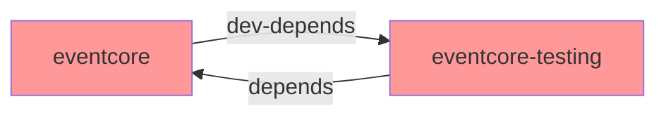
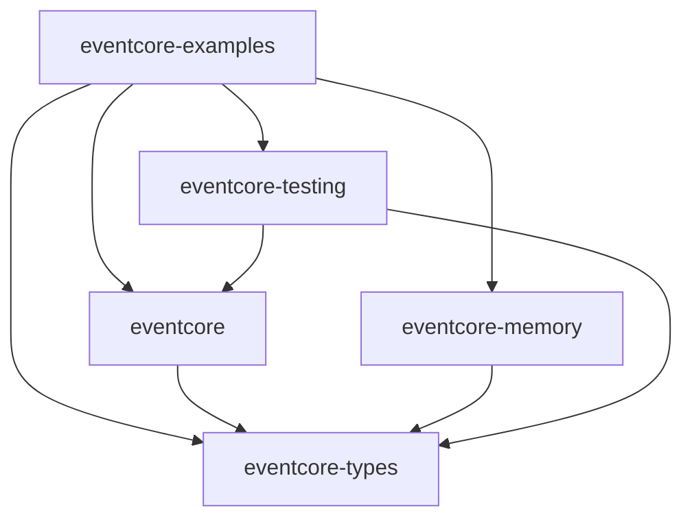

# ADR-032: Integration Test Crate for End-to-End Testing

## Status

Accepted

## Date

2026-01-01

## Deciders

- John Wilger

## Context

The EventCore workspace has several crates with different responsibilities:

- `eventcore` - Main library for application developers
- `eventcore-types` - Types for backend implementers
- `eventcore-testing` - Test utilities and helpers (per ADR-015)
- `eventcore-memory` - In-memory EventStore implementation
- `eventcore-postgres` - PostgreSQL EventStore implementation

**The Circular Dependency Problem**

ADR-031 establishes that integration tests should use `EventCollector` from `eventcore-testing` to verify command execution. However, `eventcore-testing` depends on `eventcore`. If `eventcore`'s own tests need `EventCollector`, this creates a circular dependency:



Cargo does not allow circular dependencies, even with dev-dependencies.

**Current Test Structure**

Currently, `eventcore/tests/` contains integration tests like `I-001-*.rs`, `I-003-*.rs`, etc. These are designed to test cross-crate behavior using only public APIs. However, their location inside the `eventcore` crate limits what test utilities they can use.

**Unit Tests vs Integration Tests**

Rust projects have two kinds of tests:

1. **Unit tests**: Inline with source code in `#[cfg(test)] mod tests`. These test internal implementation details and can access private items.

2. **Integration tests**: In a `tests/` directory. These test only public APIs and represent how external consumers would use the crate.

The "I-NNN" numbered integration tests in EventCore are true integration tests - they test the library from an end-user perspective. They should use only public APIs and demonstrate intended usage patterns.

**Forces at Play:**

- Integration tests need access to `eventcore-testing` utilities
- `eventcore-testing` depends on `eventcore` (cannot be reversed)
- Unit tests should stay inline with source code (project convention from AGENTS.md)
- Demo applications need a home (supports issue #260)
- Tests should prove the library works from an end-user perspective

## Decision

We will create an `eventcore-examples` crate at the workspace root to house integration tests and example applications.

### Crate Structure

```
eventcore-examples/
├── Cargo.toml
├── src/
│   └── lib.rs              # Shared test utilities, domain types
├── tests/
│   ├── I-001-*.rs          # Integration tests (migrated from eventcore/tests/)
│   ├── I-003-*.rs
│   └── ...
└── examples/
    ├── basic_usage.rs      # Demo applications
    └── ...
```

### Dependencies

```toml
[dependencies]
eventcore = { path = "../eventcore" }
eventcore-memory = { path = "../eventcore-memory" }
eventcore-testing = { path = "../eventcore-testing" }
eventcore-types = { path = "../eventcore-types" }

[dev-dependencies]
tokio = { version = "1", features = ["full"] }
```

### Dependency Graph



`eventcore-examples` sits at the TOP of the dependency graph. It can depend on everything without creating cycles.

## Alternatives Considered

### Alternative 1: Feature-flag the testing dependency

**Description**: Add `eventcore-testing` as a feature-gated dependency of `eventcore`.

**Pros**:
- Keeps tests in current location
- No new crate needed

**Cons**:
- Feature flags are viral - affects all downstream users
- Complicates dependency resolution
- Not idiomatic Rust

**Why rejected**: Feature flags for test dependencies create unnecessary complexity.

### Alternative 2: Duplicate test utilities in eventcore

**Description**: Copy needed utilities like `EventCollector` directly into `eventcore`'s test code.

**Pros**:
- No dependency changes
- Simple solution

**Cons**:
- Duplicates code between crates
- Utilities diverge over time
- Violates DRY principle

**Why rejected**: Duplication is not maintainable long-term.

### Alternative 3: Keep integration tests in eventcore, use eventcore-types directly

**Description**: Integration tests import `EventStore` from `eventcore-types` instead of using `EventCollector`.

**Pros**:
- No new crate needed
- Simple import change

**Cons**:
- Violates ADR-031 (tests should use projections, not direct event access)
- Tests don't demonstrate intended usage patterns
- Misses opportunity for reusable utilities

**Why rejected**: Conflicts with ADR-031's black-box testing approach.

### Alternative 4: Name it eventcore-integration-tests

**Description**: Create a crate specifically for integration tests.

**Pros**:
- Clear purpose in name
- Separates tests from examples

**Cons**:
- Narrow purpose - would need another crate for examples
- More crates to manage
- "examples" is more welcoming to new users

**Why rejected**: `eventcore-examples` serves both purposes (tests and demos) with a more user-friendly name.

## Consequences

### Positive

- **No circular dependencies**: The examples crate sits at the top of the dependency graph
- **True end-user perspective**: Tests prove the library works from an external consumer's viewpoint
- **Home for demos**: Example applications have a natural location (supports #260)
- **Clear separation**: Unit tests inline, integration tests in examples crate
- **Full access to testing utilities**: Can use `EventCollector` and other `eventcore-testing` helpers
- **Runnable examples**: `cargo run --example basic_usage` works out of the box

### Negative

- **More crates in workspace**: Increases from 6 to 7 crates
- **Migration effort**: Existing tests must be moved and imports updated
- **Slight indirection**: Integration tests live separately from the code they test

### Neutral

- Test discovery via `cargo test -p eventcore-examples`
- Examples discoverable via `cargo run -p eventcore-examples --example <name>`

## Related Decisions

- [ADR-015: Testing Crate Scope](ADR-015-testing-crate-scope.md) - Establishes that `eventcore-testing` contains test utilities
- [ADR-030: Layered Crate Public API Design](ADR-030-layered-crate-public-api.md) - Establishes API layering
- [ADR-031: Black-Box Integration Testing via Projections](ADR-031-black-box-integration-testing-via-projections.md) - Establishes projection-based testing approach

## References

- Rust test organization: https://doc.rust-lang.org/book/ch11-03-test-organization.html
- Cargo workspaces: https://doc.rust-lang.org/book/ch14-03-cargo-workspaces.html
- GitHub Issue #260: Demo applications
